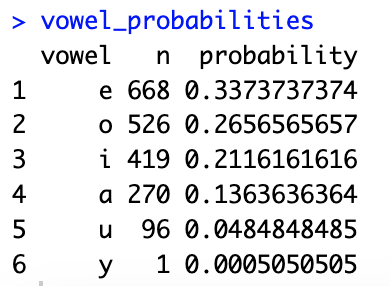
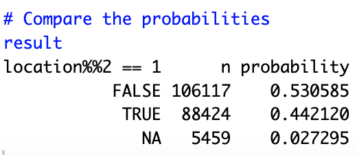

# Homework 8: Bayes Rule
## Question 1 - Resubmitted

The first question can be translated into calculating $P(Position = 3 | First Vowel = y)$. Therefore, this is the conditional probability using the formula: 

$P(A|B) = P(A \land B) / P(B)$

Please see the attaced code and inline comments for the simulation:

```
# Load the mystery function
source("https://tgstewart.cloud/mystery.R")

# Generate data
data <- mystery(200000)

# Calculate the conditional probability P(A | B) where A: *y* occurs in the third position,
# and B: *y* is the first vowel

# Count the total occurrences of 'y' (excluding missing values)
total_y_count <- sum(data$vowel == 'y' & !is.na(data$vowel))

# Count the occurrences of 'y' in the third position (excluding missing values)
y_in_third_position_count <- sum(data$location == 3 & data$vowel == 'y' & !is.na(data$vowel))

# Calculate the conditional probability as a floating-point number
P_A_given_B <- as.numeric(y_in_third_position_count) / as.numeric(total_y_count)

# Print the result
print(P_A_given_B)


```
The computed result is **$0.0994025$**, which stands for the probability of the first vowel appears in the third position given that it is y.


## Question 2

Using the following codes we can output the frequency of occurrence by calculating their probabilities running a size of 200000 rows when the location is 1.
```
# Filter samples where the location is 1
filtered_samples <- samples %>%
  filter(location == 1)

# Calculate the probabilities using pipes
vowel_table <- filtered_samples %>%
  group_by(vowel) %>%
  summarize(Probability = n() / nrow(.))

vowel_table
```
Therefore, we get the result showing that vowel **"a"** is most likely to start a word with a 0.39 probability:


## Question 3

In this question, we want to find the conditional probability of a vowel being the first vowel in a word when the first vowel in that word is in the fourth position. So we can filter the samples to include only the cases where the first vowel is in the fourth position. We then count the occurrences of each vowel as the first vowel in these filtered samples and calculate the probabilities based on these counts. 

``````
samples <- mystery(200000)

# Filter samples where the first vowel is in the fourth position
filtered_samples <- samples %>% filter(location == 4)

# Count the occurrences of each vowel as the first vowel
vowel_counts <- filtered_samples %>% count(vowel)

# Calculate the probabilities for each vowel
vowel_probabilities <- vowel_counts %>%
  mutate(probability = n / sum(n)) %>%
  arrange(desc(probability))

vowel_probabilities
``````
Therefore, we get the result showing that vowel **"e"** is the first given that the location is 4:



## Question 4

We can generate the samples and calculate non-null rows conditioned on the total samples.

``````
# Check if each sample contains at least one vowel
samples_with_vowels <- samples %>% filter(!is.na(vowel))

# Calculate the probability of at least one vowel
probability_with_vowels <- nrow(samples_with_vowels) / nrow(samples)

# Calculate the probability of no vowels
probability_no_vowels <- 1 - probability_with_vowels

# Print the result
probability_no_vowels
``````
Our result is **$0.027075$** which is the probability that a randomly selected word does not have vowels.

## Question 5

To determine whether first vowels are more likely to be in an odd or even position, we can calculate the probabilities for both odd and even positions and compare them.
``````
# Use dplyr pipeline to calculate probabilities
result <- samples %>%
  filter(!is.na(location)) %>%
  count(location %% 2 == 1) %>%
  mutate(probability = n / sum(n))

# Compare the probabilities
result
``````


The result shows that first vowels are slightly more likely to appear in even positions (53.06%) compared to odd positions (44.21%).
