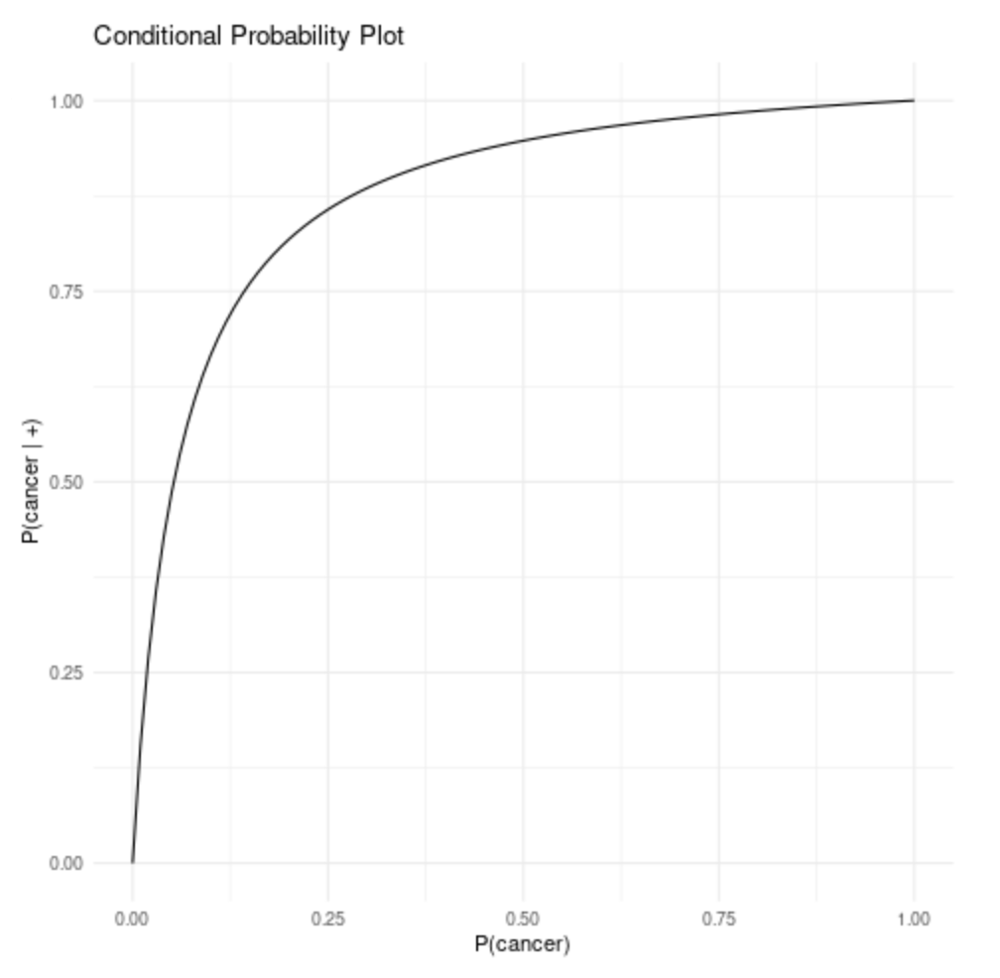

# Homework 10

## Question 1

Based on the given information,  the filled contingency table is as follows:

| | Cancer | Not Cancer | |
|:---|:---:|:---:|:---:|
|Test = + |$P(+,cancer) = tp * p$,$P(+\|cancer) = tp$, $P(cancer\|+) = tp * p/(tp * p+(1-tn) * (1-p))$|$P(+,not cancer) = (1-tn) * (1-p)$, $P(+\|not cancer) = 1-tn$, $P(cancer\|+) = (1-tn) * (1-p)/(tp * p+(1-tn) * (1-p))$|$tp * p+(1-tn)*(1-p)$ | |
|Test = - |$P(-,cancer) = p - tp * p$, $P(-\|cancer) = 1 - tp$, $P(cancer\|-) = (p-tp * p)/p-tp * p+tn * (1-p)$|$P(-,not cancer) = tn * (1-p)$, $P(-\|notcancer) = tn$, $P(not cancer\|-) = tn * (1-p)/p-tp * p+tn * (1-p)$|$p-tp * p+tn * (1-p)$| |
| |$p$|$1-p$|$1$|

## Question 2

Based on the above table, if $p$ = 0.01, $tp$ = 0.9, and $tn$ = 0.8, the positive predictive value $P(cancer|+)$ would be:

$P(cancer∣+)=tp∗p/(tp∗p+(1−tn)∗(1−p))$ = $0.9 * 0.01 / (0.9 * 0.01+0.2 * 0.99)$ = $0.0435$

The **4.35%** stands for the probability that given a patient is tested positive, the probability of the patient having a cancer. 

## Question 3

If $P(+|cancer)$ is 0.9 and $P(-|not cancer)$ is 0.95, then $tp$ is 0.9 and $tn$ is 0.95. So the equation of $P(cancer|+)$ is $0.9∗p/(0.85*p+0.05)$.

Using R, we generate a plot to visualize how the positive predictive value changes with the cancer incidence:

The plot shows that as the cancer incidence increases, the probability of having cancer given a positive test result generally rises, exhibiting a convex shape where a positive test result becomes a stronger indicator of cancer beyond a certain incidence level.

## Question 4

The given statement asserts that these two probabilities are equal:

$$P(\text{UVA football is better than JMU football}|\text{JMU wins head to head match-up}) = P(\text{UVA football is better than JMU football})$$

Given the Bayes' theorem, our target conditional probability is equal to:

$$P(\text{JMU wins head-to-head match-up}|\text{UVA football is better than JMU football}) = \frac{P(\text{UVA football is better than JMU football}|\text{JMU wins head to head match-up}) \cdot P(\text{JMU wins head-to-head match-up})}{P(\text{UVA football is better than JMU football})}$$

With our previous assumption, we can clean the equation and get:

$$P(\text{JMU wins head-to-head match-up}|\text{UVA football is better than JMU football}) = P(\text{JMU wins head-to-head match-up})$$

So these two probabilities must also be equal.

