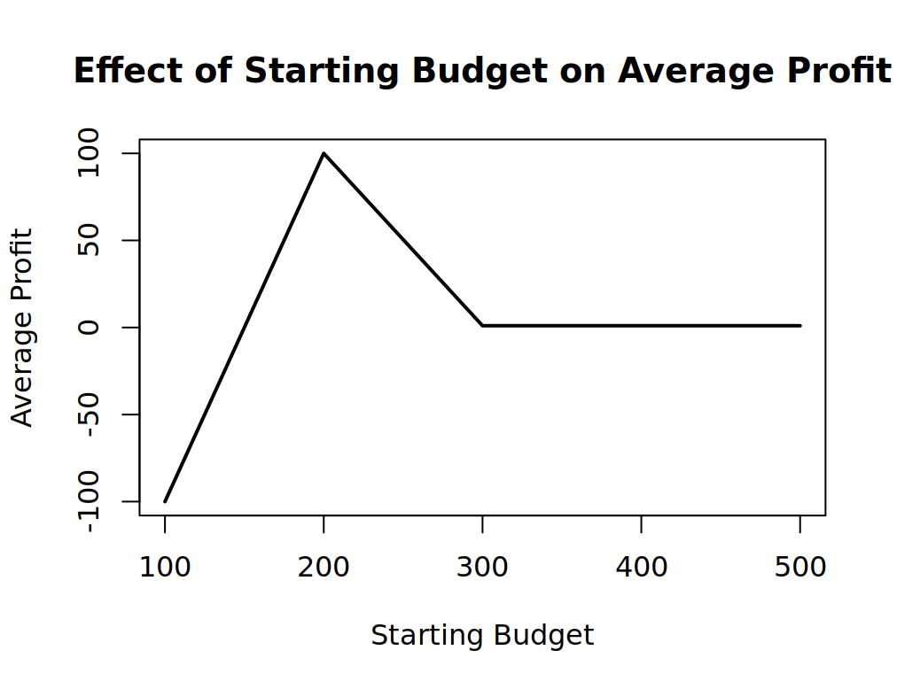
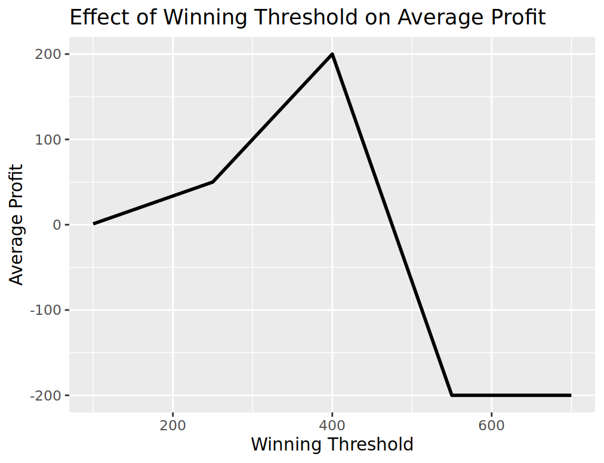
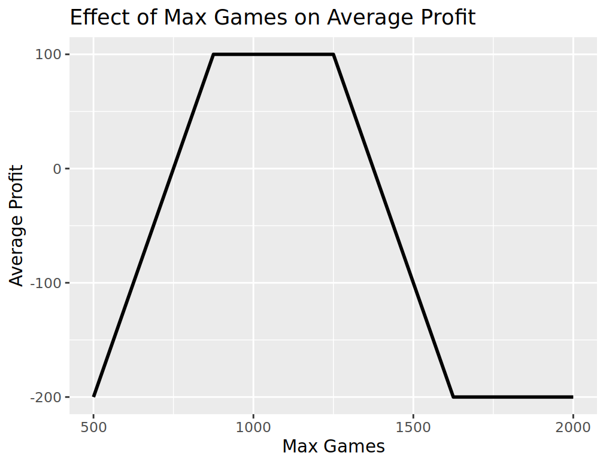
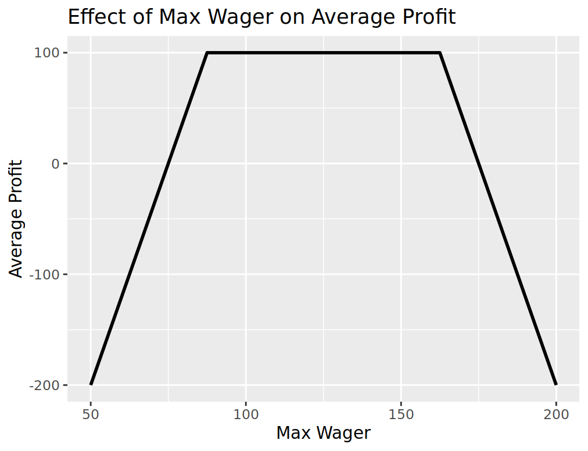

# Homework 16
## Earnings evolvement over number of games

I used the following code to generate the average earnings:
``````
# Set the parameters
  starting_budget <- 200
  winning_threshold <- 300
  max_games <- 1000
  max_wager <- 100
  R <- 1000  # Number of replicates
  output <- rep(NA, R)
  
  # Create a matrix to store the earnings data for all replicates
  earnings_matrix <- matrix(NA, nrow = R, ncol = max_games)
  
  # Run multiple replicates and store earnings data
  for (r in 1:R) {
    simulation_result <- one_series(max_games, starting_budget, winning_threshold, max_wager)
    earnings <- simulation_result$ending_budget  # No need to subtract starting budget
    # Pad earnings with NAs to match max_games
    earnings <- c(earnings, rep(NA, max_games - length(earnings)))
    earnings_matrix[r, ] <- earnings
  }
  
  # Create a line plot to visualize earnings over wagers
  library(ggplot2)
  earnings_df <- data.frame(GameIndex = 0:(max_games - 1), Earnings = colMeans(earnings_matrix, na.rm = TRUE))
  
  ggplot(earnings_df, aes(x = GameIndex, y = Earnings)) +
    geom_line(size = 1, color = "blue") +
    labs(x = "Wager Number", y = "Earnings") +
    ggtitle(paste("Earnings Evolution Over Wagers (Repetitions:", R, ")")) +  # Include the number of repetitions in the title
    geom_hline(yintercept = starting_budget, linetype = "dashed", color = "red") +  # Set the starting budget line to 200
    geom_hline(yintercept = winning_threshold - starting_budget, linetype = "dotted", color = "green") +  # Add earnings cap line at $300
    geom_vline(xintercept = max_games - 1, linetype = "dotted", color = "blue") +  # Max games (number of wagers) on x-axis as dotted
    theme_minimal()
``````

### Explanation:

In this code, I set parameters for a computer simulation that models a game with specific rules. These parameters are as follows:

- 'Starting Budget (starting_budget)': The player begins with $200.
- 'Winning Threshold (winning_threshold)': The player aims to reach $300 in earnings.
- 'Maximum Games (max_games)': The simulation runs for a maximum of 1000 games.
- 'Maximum Wager (max_wager)': The player can bet up to $100 in a single round.
- 'Number of Replicates (R)': The simulation is repeated 1000 times.

The goal is to observe the player's earnings over multiple iterations, adhering to the defined rules.

The code works as follows:

- An 'earnings_matrix' is created to store earnings data for all replicates (1000 rows). Each row represents a game with a maximum of 1000 columns, ensuring uniform data structure.

- A loop runs the simulation 1000 times, where the 'one_series' function calculates earnings based on the parameters. Earnings are recorded in the 'earnings_matrix,' with padding for consistent dimensions.

- After all simulations, a line plot is generated using 'ggplot2.' The x-axis shows the number of plays, and the y-axis represents earnings.

This code visualizes how a player's earnings change over repeated plays while considering the defined rules and constraints. It provides insights into potential game outcomes within these parameters:


## Parameter changing
### Changing starting budget
``````
# Load required libraries
require(magrittr)

# Define functions as provided in your code

# Function to run the simulation for different starting budgets
run_simulation_for_budgets <- function(starting_budget, winning_threshold, max_games, max_wager, num_simulations) {
  average_profits <- numeric(length(starting_budget))
  
  for (i in 1:length(starting_budget)) {
    set.seed(i)  # Set a different seed for each simulation
    ledger <- one_series(max_games, starting_budget[i], winning_threshold, max_wager)
    average_profits[i] <- mean(replicate(num_simulations, profit(ledger)))
  }
  
  return(average_profits)
}

# Set the parameters
starting_budget <- seq(100, 500, by = 100)  # Starting budget range
winning_threshold <- 300
max_games <- 1000
max_wager <- 100
num_simulations <- 1000  # Number of simulations to run for each budget

# Run the simulation for different starting budgets
average_profits <- run_simulation_for_budgets(starting_budget, winning_threshold, max_games, max_wager, num_simulations)

# Visualize how changing starting budget affects profits
plot(starting_budget, average_profits, type = "l", lwd = 2, xlab = "Starting Budget", ylab = "Average Profit",
     main = "Effect of Starting Budget on Average Profit")

``````
The plot shows that the starting budget of \$200 would have the higest averge profit and remains flat after \$300:



Using the same coding logic, I generated the other three plots by changing the three parameters:

### Changing winning_threshold



The average profit increases to when the threshold is 400 and then decreases.

### Changing max games



The profit increases to when max games reache around 900 and remains flat to when games reach 1250 and then drops.

### Changing max wager



The profit increases, remains flat and then drops as the max wager increases.

## Limitations of this simulation
- Limited Exploration of Parameters: The simulation explores a predefined set of parameters, such as the starting budget and winning threshold, limiting the generalizability of the results.
- Oversimplification of Betting Strategy: The simulation employs a simplified betting strategy, the Martingale system, which may not accurately represent the diversity of betting strategies used by real players. 
- Idealized Casino Rules: Different casinos may have varying rules and policies, such as maximum bet limits and payout structures. The simulation does not account for these variations, assuming uniform conditions.
- Risk of Short-Term Emphasis: The simulation may give the impression that the Martingale strategy is profitable in the short term, but it does not address the long-term risks associated with this strategy, especially during extended losing streaks.
