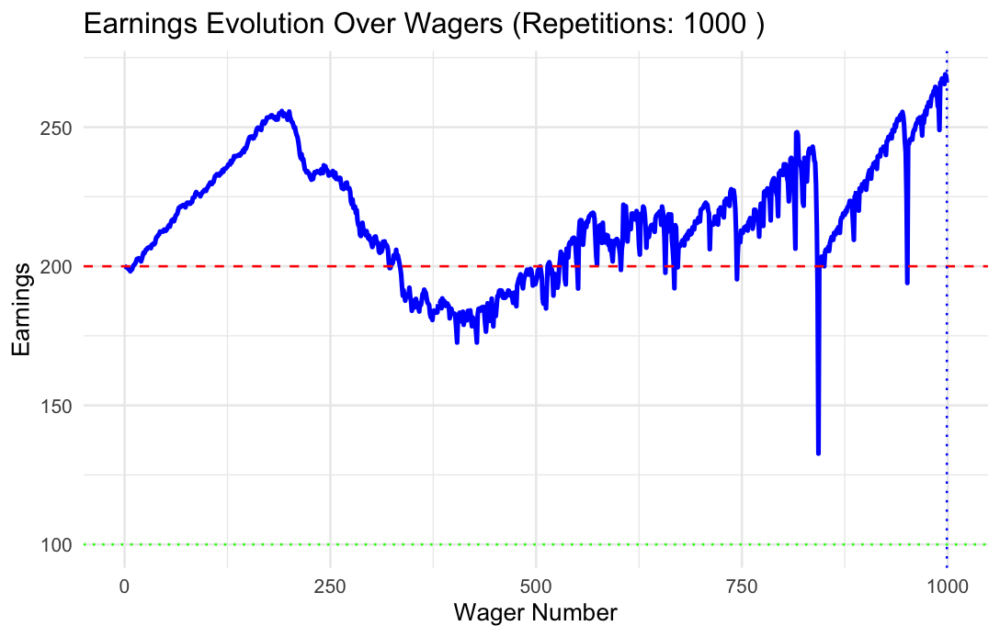

# Homework 16
## Earnings evolvement over wagers

I used the following code to generate the average earnings:
``````
# Set the parameters
starting_budget <- 200
winning_threshold <- 300
max_games <- 1000
max_wager <- 100
R <- 5000  # Number of replicates
output <- rep(NA, R)

# Create a matrix to store the earnings data for all replicates
earnings_matrix <- matrix(NA, nrow = R, ncol = max_games)

# Run multiple replicates and store earnings data
for (r in 1:R) {
  simulation_result <- one_series(max_games, starting_budget, winning_threshold, max_wager)
  earnings <- simulation_result$ending_budget - starting_budget
  # Pad earnings with NAs to match max_games
  earnings <- c(earnings, rep(NA, max_games - length(earnings)))
  earnings_matrix[r, ] <- earnings
}

# Create a line plot to visualize earnings over wagers
library(ggplot2)
earnings_df <- data.frame(GameIndex = 1:max_games, Earnings = colMeans(earnings_matrix, na.rm = TRUE))
ggplot(earnings_df, aes(x = GameIndex, y = Earnings)) +
  geom_line(size = 1, color = "blue") +
  labs(x = "Wager Number", y = "Earnings") +
  ggtitle("Earnings Evolution Over Wagers") +
  theme_minimal()
  
``````

### Explanation:

I'm using R to run a computer simulation of a gambling strategy. First, I decide how much money I start with (the starting budget), how much money I want to win before quitting (the winning threshold), and how many rounds or games I'm willing to play (max games). Additionally, I set a limit on how much I can bet in one game (the max wager). 

I want to see how this strategy performs in different scenarios, so I'm going to run the simulation several times. The number of times I repeat the simulation is called "R," and in this example, I choose 5000 times. 

I need a way to keep track of the results from each round of gambling. So, I create a big table, or matrix, where I'll store this information. This table is called "earnings_matrix."

For each round of gambling, I use the "one_series" function to simulate how much money I'll have at the end. This function calculates my earnings for each game in the series. I store these earnings in a list. To make sure all my lists are the same length, I add empty spaces (NA values) to them so that they all have as many games as I initially decided (max games).

All of these earnings lists go into my "earnings_matrix" to compare the results later.

Now, I want to visualize how my earnings change as I play more games. To do that, I use a library called "ggplot2" to create a line chart. This chart shows the number of games on the bottom (x-axis) and my average earnings on the side (y-axis). 

As I run the simulation, I found the plots vary significantly as the number of replicates differs. So here are the figures that I created by changing the number of replicates:

- Replicates: 100


- Replicates: 1000



- Replicates: 5000


Description: In general, the earnings increase until the wagers reach somewhere near 188, and it declines quickly later. After around 300 wagers, the plot has much zig-zagging.

## Parameter changing

