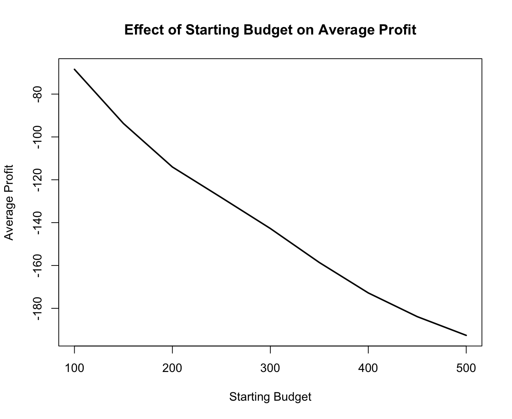

# Homework 16
## Introduction to Roulette
Roulette is a popular and iconic casino game that has been captivating players for centuries. It is a game of chance that originated in France in the 18th century. The name "roulette" itself means "little wheel" in French, and that's exactly what the game revolves around – a spinning wheel. The game is designed for players to bet on where a small ball will land once the wheel comes to a stop.

Players place their bets on various options, including specific numbers, groups of numbers, colors (red or black), odd or even numbers, or high and low ranges. The game's outcome is purely based on chance, as the ball's landing spot is completely unpredictable.

##The Martingale Strategy

The Martingale strategy is a betting system frequently employed in casino games, notably in games like roulette. This approach is characterized by its progressive betting nature, with the fundamental premise of recovering losses and securing a profit equivalent to the initial wager. Here is a structured breakdown of the Martingale strategy:

1. **Initial Wager**: The strategy commences with an initial bet placed on an outcome with approximately a 50/50 probability of success, such as betting on red or black in a game of roulette.
2. **Doubling of Bets Following Losses**: In the event of a loss on the initial bet, the strategy mandates doubling the wager in the subsequent round.
3. **Iterative Doubling with Each Consecutive Loss**: The process continues, with each loss triggering a doubling of the bet in a quest to recoup prior losses.
4. **Resetting After a Win**: Upon achieving a winning outcome, the strategy prompts a return to the initial wager.

The fundamental concept behind the Martingale strategy is the belief that, over time, a winning outcome will eventually be realized, which would subsequently offset all prior losses, ultimately yielding a profit equivalent to the original wager.

## Average Earnings

- Plot 1: The loser plot:


This plot represents a series of games where the Martingale strategy led to a losing outcome. The x-axis, labeled "Game Index," tracks the progression of games, while the y-axis, labeled "Budget," represents the player's budget over time.

The player starts with an initial budget of $200. The bets are adjusted based on previous outcomes and the maximum wager limit. In this series, the outcome of the first game is "red," which results in a bet of \$1.

Subsequent bets and outcomes are calculated using the Martingale strategy. As the player experiences losses, the bets are doubled in an attempt to recover previous losses.

The player's budget fluctuates over time, and as seen in this example, it eventually reaches zero, indicating a losing session.
The series ends when the player's budget falls to zero, which is a stopping rule defined by the Martingale strategy.

- Plot 2: The winner plot:


This plot, on the other hand, represents a series of games where the Martingale strategy led to a winning outcome. It follows the same axes and labels as the first plot, but the outcome is different. Here's an interpretation:

Similar to the first plot, the player starts with a budget of \$200 and applies the Martingale strategy.

In this series, the first game's outcome is "red," resulting in a bet of $1. Unlike the "Loser" series, the player experiences favorable outcomes and, as a result, doesn't need to double the bets to recover losses. The player's budget gradually increases as more games are played.

The series continues until the player's budget reaches or exceeds a specified winning threshold of $300, at which point the player stops playing.

## Calculation of average earnings
In addition to the provided code, I used the following code to generate the average earnings in a numerical way:

``````
profit <- function(ledger) {
  n <- nrow(ledger)
  profit <- ledger[n, "ending_budget"] - ledger[1, "starting_budget"]
  return(profit)
}

# Set the parameters for the simulation
starting_budget <- 200
winning_threshold <- 300
max_wager <- 100
max_games <- 1000
num_simulations <- 1000

# Calculate average earnings
average_profits <- numeric(num_simulations)

for (i in 1:num_simulations) {
  set.seed(i)
  ledger <- one_series(max_games, starting_budget, winning_threshold, max_wager)
  average_profits[i] <- profit(ledger)
}

# Calculate the mean of profits
average_earnings <- mean(average_profits)
cat("Average Earnings:", average_earnings)
``````

The negative result of -51.231 means that, on average, across a large number of simulations, the player ends up losing approximately $51.231. This suggests that while the martingale strategy might lead to occasional wins, the cumulative effect over multiple games is a net loss. The inherent risks associated with doubling wagers after losses make it challenging to consistently profit from this betting strategy in the long run.

## Parameter changing
### Changing starting budget
Holding all others stopping rules constant (winning_threshold <- 300, max_games <- 1000, max_wager <- 100), the first parameter to alter while others being constant is the starting budget. 

Here's the code to generate the plot:
``````
require(magrittr)
simulate_one_series <- function(starting_budget, winning_threshold, max_games, max_wager, num_simulations) {
  average_profits <- numeric(num_simulations)
  
  for (i in 1:num_simulations) {
    set.seed(i)
    ledger <- one_series(max_games, starting_budget, winning_threshold, max_wager)
    average_profits[i] <- profit(ledger)
  }
  
  return(mean(average_profits))
}

# Set the parameters
winning_threshold <- 1000
max_games <- 1000
max_wager <- 100
num_simulations <- 1000

starting_budgets <- seq(100, 500, by = 50)
results <- data.frame(starting_budget = starting_budgets, average_profit = 0)

for (i in 1:length(starting_budgets)) {
  starting_budget <- starting_budgets[i]
  print(paste("Simulating for starting budget:", starting_budget))
  average_profit <- simulate_one_series(starting_budget, winning_threshold, max_games, max_wager, num_simulations)
  results[i, "average_profit"] <- average_profit
}

plot(results$starting_budget, results$average_profit, type = "l", lwd = 2, xlab = "Starting Budget", ylab = "Average Profit",
     main = "Effect of Starting Budget on Average Profit")

``````


As the starting budget increases, the average profit declines steadily and remains negative, emphasizing the Martingale strategy's tendency to result in long-term losses despite any temporary recoveries.

### Changing winning_threshold

Holding all other stopping rules constant (starting_budget <- 200
, max_games <- 1000, max_wager <- 100), I used the same for-loop logic to see how the winnning_threshold would affect the profit, the plot looks like this:


The average profit begins at zero when the winning threshold is set to 100, indicating a balanced outcome, but then steadily declines as the winning threshold increases, reaching its lowest point when the threshold is 700. This trend highlights that as the desired winning amount becomes more ambitious, the strategy's profitability diminishes, ultimately leading to more substantial average losses.

### Changing max games
Holding all other stopping rules constant (starting_budget <- 200
, winning_threshold <- 300 max_wager <- 100), I used the same for-loop logic to see how the max_games would affect the profit, the plot looks like this:


The initial setting of 500 games results in an average profit of approximately -48, indicating a notable loss on average. However, as the maximum games increase, the average profit experiences a rapid decline, reaching its lowest point at around -51 when the maximum games are set to 780. This suggests that extending the duration of the game exacerbates the losses incurred by the strategy, potentially due to the increased opportunity for unfavorable outcomes. Surprisingly, once the maximum games surpass 780, the average profit remains relatively flat, indicating that further extending the duration of play does not significantly affect the strategy's performance. 

### Changing max wager

Holding all other stopping rules constant (starting_budget <- 200
, winning_threshold <- 300, max_games <- 1000), I used the same for-loop logic to see how the max_wager would affect the profit, the plot looks like this:


As the maximum wager increases, we observe that the average profit initially experiences a gradual rise. However, this upward trend slows down as the maximum wager exceeds 150, and the average profit remains flat. Despite the gradual increase, it's essential to note that the average profit remains consistently negative, indicating that the Martingale strategy, even with higher maximum wagers, is not capable of generating positive average returns in the long run. 

## Calculation of average number of plays
To calculate the average number of playes within the stopping rules, I used this code:

``````
starting_budget <- 200
winning_threshold <- 300
max_wager <- 100
max_games <- 1000
num_simulations <- 1000

average_plays <- numeric(num_simulations) 

for (i in 1:num_simulations) {
  set.seed(i)
  ledger <- one_series(max_games, starting_budget, winning_threshold, max_wager)
  average_plays[i] <- nrow(ledger) - 1 
}

average_avg_plays <- mean(average_plays)
cat("Average Average Number of Plays:", average_avg_plays, "\n")
``````

The given result of 203.914 suggests that, on average, it takes approximately 203.914 plays to either reach the winning threshold of $300 or deplete the starting budget of $200 within the stopping rules defined in the simulation. 


## Limitations of this simulation
- Limited Exploration of Parameters: The simulation explores a predefined set of parameters, such as the starting budget and winning threshold, limiting the generalizability of the results.
- Oversimplification of Betting Strategy: The simulation employs a simplified betting strategy, the Martingale system, which may not accurately represent the diversity of betting strategies used by real players. 
- Idealized Casino Rules: Different casinos may have varying rules and policies, such as maximum bet limits and payout structures. The simulation does not account for these variations, assuming uniform conditions.
- Risk of Short-Term Emphasis: The simulation may give the impression that the Martingale strategy is profitable in the short term, but it does not address the long-term risks associated with this strategy, especially during extended losing streaks.

In summary, the Martingale strategy presents a structured approach to betting in casino games. While it may appear to offer a straightforward path to profit, prudence dictates a comprehensive understanding of its risks and the necessity of careful bankroll management when adopting this strategy.