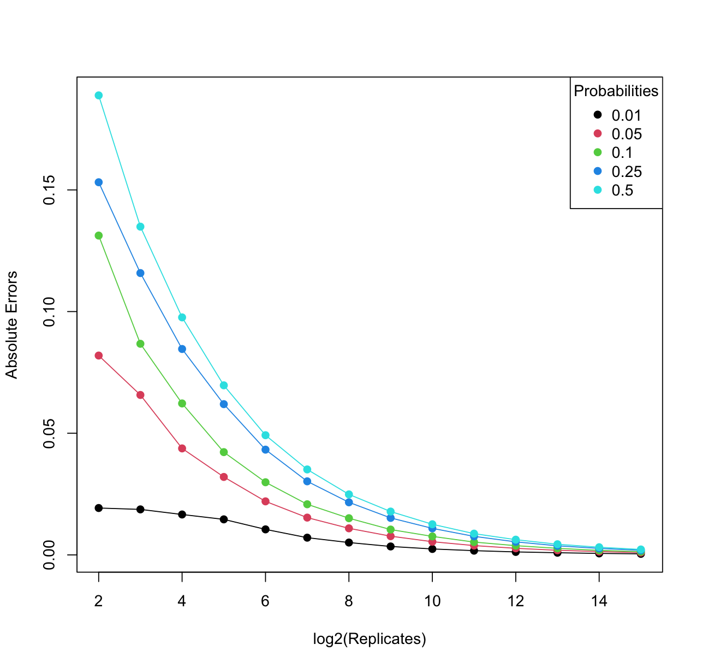
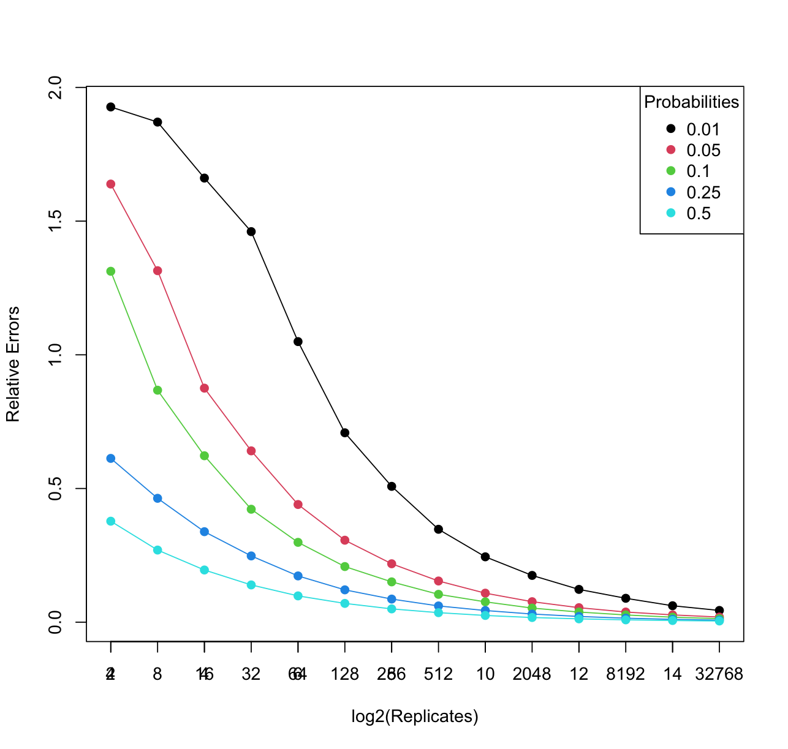
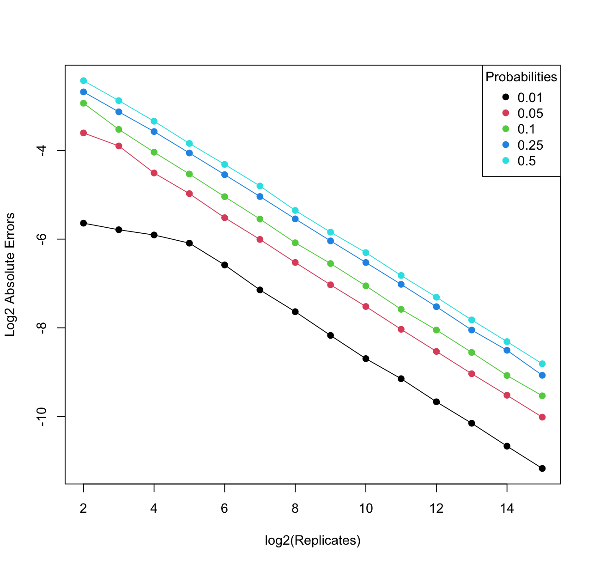
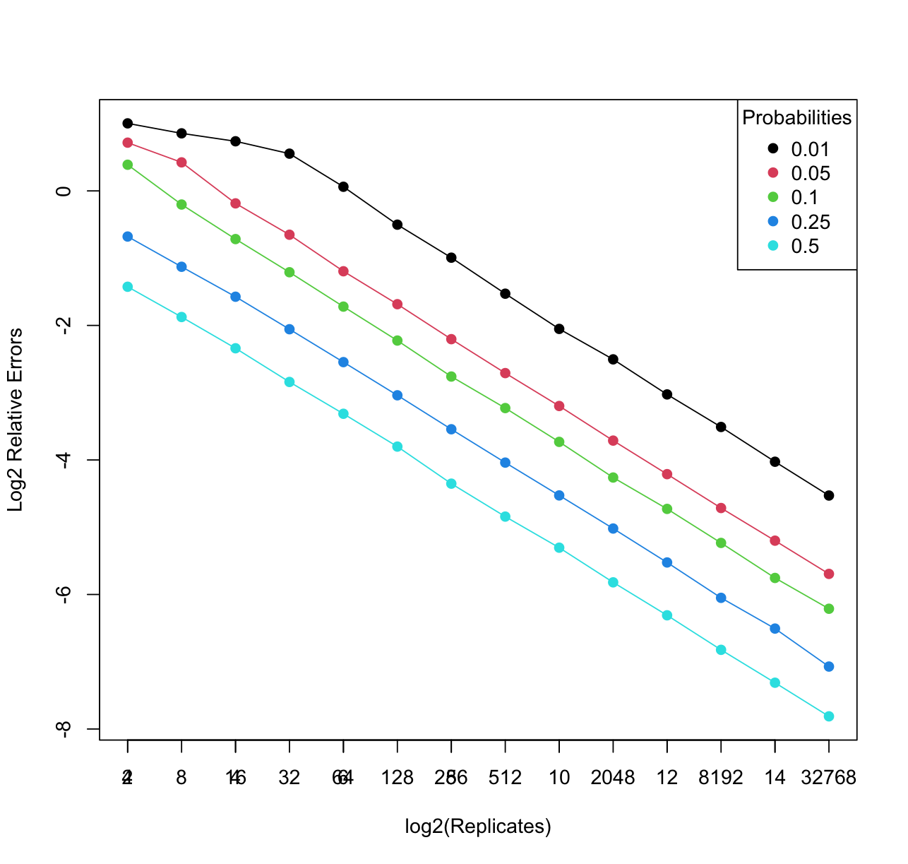

# Homework 17
## The Importance of Estimating Probabilities

Estimating probabilities is a cornerstone of data science. It enables us to make informed decisions based on data and observations. Whether we're predicting stock market trends, determining the likelihood of a disease outbreak, or optimizing supply chain operations, probability estimation plays a central role.

**Absolute error** is a concept used in various fields, including data science, to quantify the magnitude of the difference between an estimated value and the true or expected value. It provides a straightforward way to measure how far off our estimation is from reality. In mathematical terms, absolute error is calculated as the absolute difference between the estimated value (often denoted as p̂) and the true value (denoted as p):

Absolute Error = |p - p̂|

Where "p" represents the true value.
"p̂" represents the estimated or calculated value.

Absolute error is a valuable measure because it gives you a clear sense of the magnitude of your estimation inaccuracies, regardless of whether you overestimated or underestimated the true value.

**Relative error**, on the other hand, provides a standardized way to express the accuracy of an estimation by comparing it to the true value. It is particularly useful when you want to understand how significant your estimation error is relative to the magnitude of the true value. Relative error is calculated as the ratio of the absolute error to the true value:

Relative Error = |p - p̂| / |p|

Where "p" represents the true value.
"p̂" represents the estimated or calculated value.

Relative error is beneficial because it scales the error to the size of the true value. It allows you to compare the accuracy of different estimations, especially when dealing with data of varying scales or magnitudes.


## Ploting the absolute error and relative error
Code:
``````
replicates <- 2^(2:15)
probabilities <- c(0.01, 0.05, 0.10, 0.25, 0.50)

# Initialize matrices to store absolute and relative errors with zeros
absolute_errors <- matrix(0, nrow = length(replicates), ncol = length(probabilities))
relative_errors <- matrix(0, nrow = length(replicates), ncol = length(probabilities))

for (i in 1:length(replicates)) {
  for (j in 1:length(probabilities)) {
    p <- probabilities[j]
    r <- replicates[i]
    p_hat <- rbinom(5000, r, p) / r
    absolute_errors[i, j] <- mean(abs(p_hat - p))
    relative_errors[i, j] <- mean(abs(p_hat - p) / p)
  }
}

# Create a plot of absolute errors
plot(log2(replicates), absolute_errors[, 1], ylim = range(absolute_errors), xlab = 'log2(Replicates)', ylab = 'Absolute Errors', type = 'n')

# Add lines and points for different probabilities
for (i in 1:length(probabilities)) {
  lines(log2(replicates), absolute_errors[, i], col = i, lwd = 1)
  points(log2(replicates), absolute_errors[, i], col = i, pch = 19)
}

# Create a legend for probabilities
legend("topright", legend = as.character(probabilities), col = 1:length(probabilities), pch = 19, title = "Probabilities")

# Create a plot of relative errors
plot(log2(replicates), relative_errors[, 1], ylim = range(relative_errors), xlab = 'log2(Replicates)', ylab = 'Relative Errors', type = 'n')

# Add lines and points for different probabilities
for (i in 1:length(probabilities)) {
  lines(log2(replicates), relative_errors[, i], col = i, lwd = 1)
  points(log2(replicates), relative_errors[, i], col = i, pch = 19)
}

# Create a legend for probabilities
legend("topright", legend = as.character(probabilities), col = 1:length(probabilities), pch = 19, title = "Probabilities")
axis(1, at = log2(replicates), labels = replicates)
``````

And there are the plots generated:
1. Absolute error



Interpretation: 

In the first set of graphs (Absolute Error), the x-axis represents the number of replicates in a log2 scale, which essentially shows the growth in sample size.

The y-axis represents the absolute errors, which measures how far off the estimated probability is from the true value.

As we can see, for each probability level (different colors), the absolute error decreases as the number of replicates increases. This is an intuitive result because with more data, our estimations tend to be closer to the true values.
The linear relationship between the number of replicates (on a log2 scale) and absolute error suggests that the accuracy of our estimations improves as we collect more data.

2. Relative error



Interpretation:

In the second set of graphs (Relative Error), the x-axis remains the number of replicates in a log2 scale.

The y-axis represents the relative errors, which scales the error to the magnitude of the true value.

Similar to the absolute error graphs, we observe that the relative error decreases as the number of replicates increases for each probability level.

This indicates that, with more data, our estimations become more accurate in relation to the true values, irrespective of the scale of the probabilities involved.

If changing the y-axis to the log2 scale, the plots look like as below:

1. Absolute error



Interpretation:

In the log2-scaled Absolute Error graph, the x-axis still represents the number of replicates in a log2 scale.

The y-axis, now in a log2 scale, represents the log-transformed absolute errors. This transformation helps compress and visualize a wide range of absolute errors.

The linear relationship between the x-axis (log2 of replicates) and the log2-scaled absolute error suggests that as the sample size (number of replicates) increases exponentially, the log-scaled absolute error decreases in a linear fashion.

2. Relative error



Interpretation:

In the log2-scaled Relative Error graph, similar to the absolute error, the x-axis represents the log2 of the number of replicates.

The y-axis, also log2-scaled, shows that the log-transformed relative errors decrease linearly as the number of replicates increases on a log2 scale.

## Key Takeaways

1. When changing the y-axis to a log2 scale in both Absolute Error and Relative Error graphs, a linear relationship is observed between the log2-scaled errors and the log2-scaled number of replicates.

2. Increasing the sample size (number of replicates) exponentially leads to a predictable and steady decrease in errors, whether they are absolute or relative.

3. Applying a log2 transformation to the y-axis in both the Absolute Error and Relative Error graphs reveals a linear relationship between the log2-scaled errors and the log2-scaled number of replicates. This linear relationship demonstrates that as the sample size (number of replicates) increases exponentially, the log2-scaled errors decrease linearly.

4. These observations underscore the critical role of sample size in probability estimation and reinforce the need for a robust data collection process to enhance the accuracy of predictions.