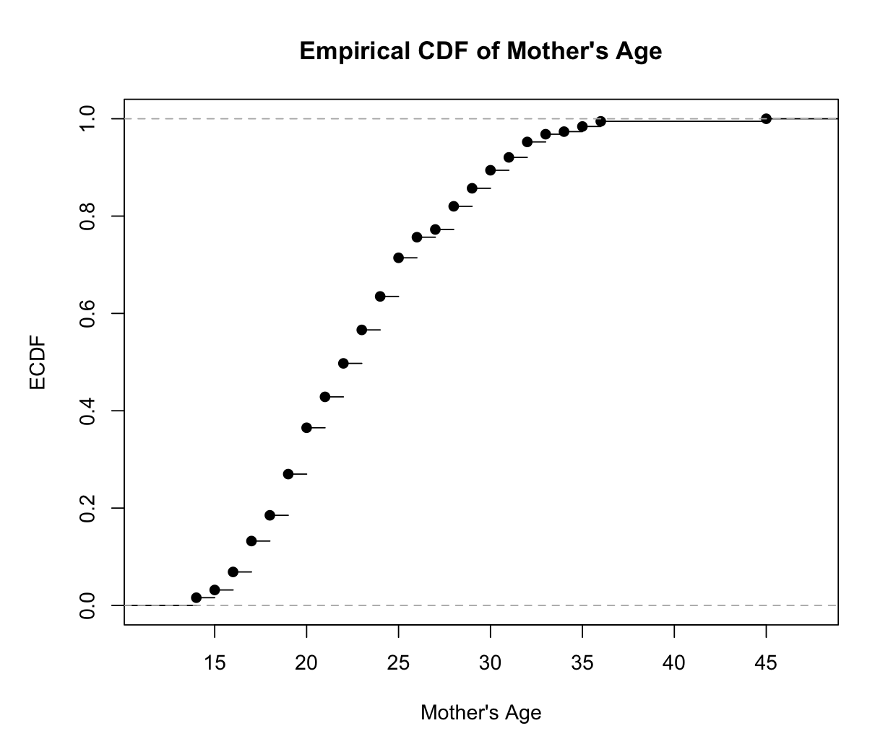
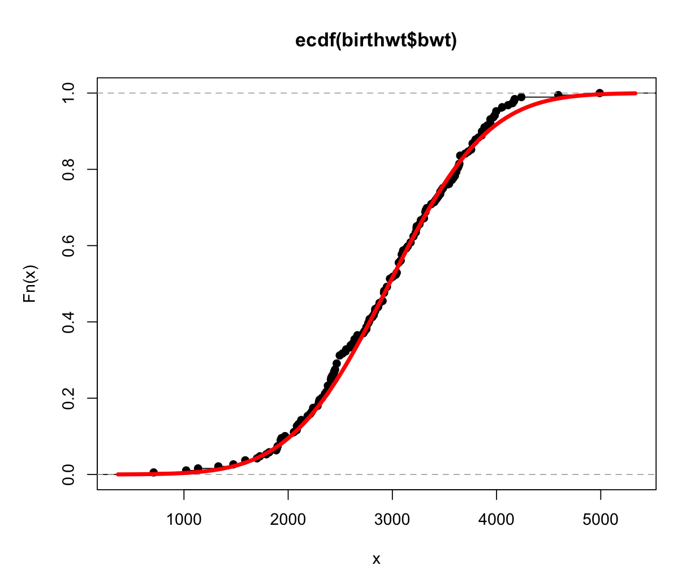
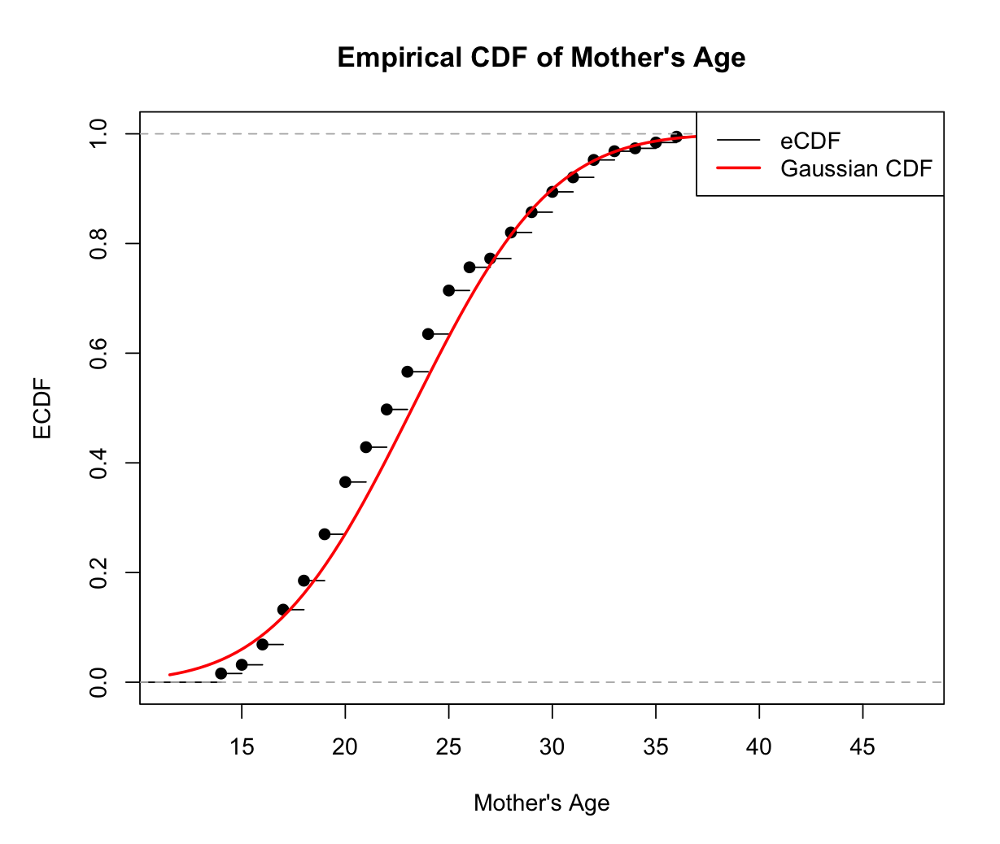
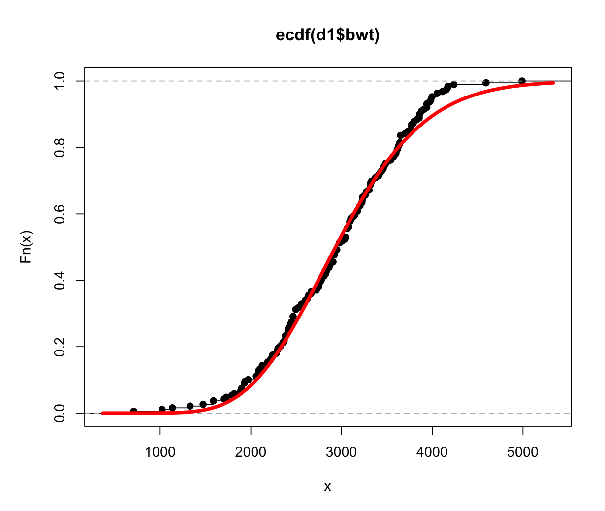
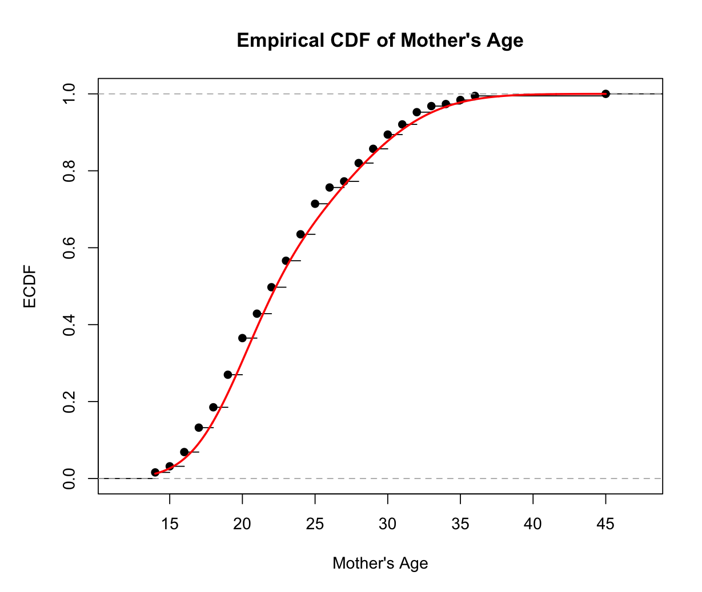

# Homework 19
## Assessment Section 1
Using the ecdf function in R, we can plot the mother's age and its empirical CDF:


We can also use ``ecdf_obj <- ecdf(MASS::birthwt$age)
prob_35_or_higher <- 1 - ecdf_obj(34)
prob_35_or_higher`` to calculate that the probability of observing an age of 35 or higher among mother-infant pairs is *0.02645503*.

## Assessment Section 2
By tuning the slider, I found the best setting to fit the birthweight distribution is when mean is 2970 and the standard deviation is 740.

The mean changes how the line moves up and down the left diagonal line, while the standard deviation changes how the line is flat or uneven.

## Assessment Section 3
Inserting the best parameters identified in section 2, I generated the following plot, where the red line denotes the Gaussian distribution:


Using ```probability_low_birth_weight <- pnorm(2500, mean = 2970, sd = 740)```, ths calculated probability of observing a low birth weight infant is *0.2626701*.

By inserting the sample mean and standard distribution into the Gaussian function, I generated the following plot to denotes mother's age distribution.



## Assessment Section 4
The best α is 15 and the best β is 0.005 when I changed different combinations using the slider.

## Assessment Section 5
The gamma distribution using the above parameters looks as below:


Using this model, the probability of observing a very low birth weight infant is *0.0103*.

plot of the eCDF of mother’s age in years using the sample mean and distribution is plotted as follows:


## Assessment Secrion 6
The best parameters that I found are:
- m1 = 3400; s1 = 520
- m2 = 2520; s2 = 570
- α1 = 0.48.

Of all the distributions, I think the mixture distribution fits the birthweight dataset the best, because by eye, it has the most overlapping with the dataset which means the least standard error. 



Using the mixture approach, the plot is created to show the mixture distribution. Among the Gaussian, gamma, and mixture distributions, I think the mixture approach gives the best description, because it covers nearly all data points in the mother's age column.

