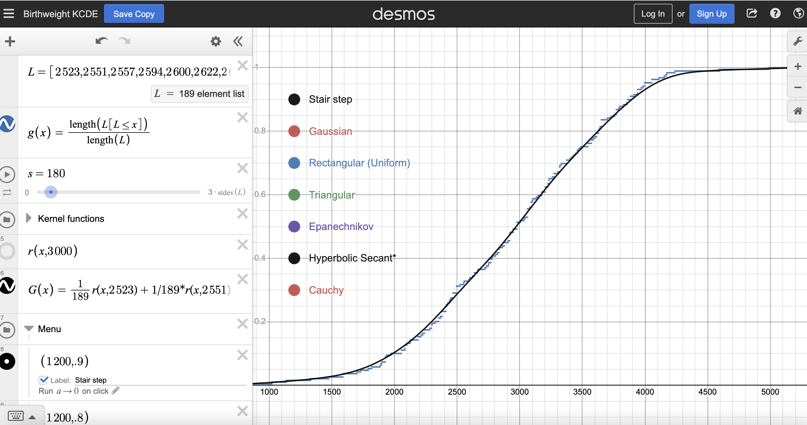

# Homework 20
## Question 1

Here're the best s that fits each kernal distribution:
- Gaussian: s = 180

- Regtangular (uniform): s = 550

- Triangular: s = 950

- Epanechnikov: s = 660

- Hyperbolic Secant: s = 240

- Cauchy: s = 55


## Question 2

I selected the s based on two criteria:
1. The level of smoothing: I chose the s once the curve reaches the smooth condition.
2. The level of fitting: I adjust the s from small to large in order to find the curve that fits the data.

Therefore, because these two criteria go the opposite way, so I chose the s when these two converge in the status where the curve is smooth and fits the data in the most optimal way.

## Question 3
I used the following code to generate the plot:
``````
Fhat <- function(x,s) rowMeans(outer(x,d1$age,function(a,b) pnorm(a,b,s)))

plot(ecdf(d1$age),do.points = FALSE)

curve(Fhat(x,2),add=TRUE,col="red",lwd=3)

legend("left", legend = c("eCDF","Gaussian"), col = c("black","red"), lwd = 3, bty = "n")
``````

By setting s to be 2, I found the most fit curve to match the age data.

Here's the plot:


## Question 4
Using this kernal function, when I run ``probability_age_leq_25 <- Fhat(25, s)``, it shows the probability is *0.6809845*.

## Question 5
Both kernel smoothing and mixture distributions are methods used to estimate probability density functions from data. They share similarities in that they aim to capture the underlying structure of the data by combining simpler distributions. However, there are differences in their approaches. Mixture distributions explicitly combine multiple component distributions, while kernel smoothing uses a smoothing kernel to estimate the density function locally around each data point. Both methods can be adapted to different data characteristics and have parameters that can be tuned to fit the data effectively.

For kernel smoothing, you need to experiment with different values of the bandwidth (s) to achieve a good fit, and you can visually assess the results. For mixture distributions, you choose their parameters (𝛼 and 𝛽) to best fit the data, and this is often determined through a more systematic modeling process.