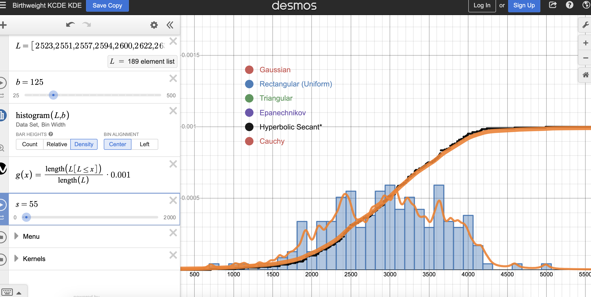

# Homwork 21
## Assessment 1
For the Gaussian model, the best parameters that I selected are when **m is 2990 and s is 680**. The different between this selection process and the previous one is that this time, there are two curves to be focused, which means a more precise fitting progress. When only looking at the CDF, even if the curve fits seemingly, the PDF does not represent the true distribution, so by adding an additional curve, the parameters could truly reveal the real distribution.

For the Gamma model, the previous parameters that I chose is when alpha is 15 and beta is 0.005, but when plotting the pdf, I found that the central line is not matching what the true distribution. So by looking at the pdf, the new parameters are when **alpha is 16 and beta is 0.00535**. This new combination of curves provides a more precise fitting because the beta especially is very sensitive to changing.

## Assessment 2

Here're the PDFs when plugging in the s previously when only looking at the CDFs.

1. Gaussian:s = 180

2. Rectangular: s = 550

3. Triangular: s = 950

4. Epanechnikov: s = 660

5. Hyperbolic Secant:s = 240

6. Cauchy: s = 55


So only Triangular and Epanechnikov distributions are acceptable in smoothing and all other distributions are overfitting. Therefore, we need to choose new s to fit each distribution by looking at both PDF and CDF:

1. Gaussian: s = 300

2. Rectangular: s = 1440

3. Triangular: s = 700

4. Epanechnikov: s = 770

5. Hyperbolic Secant:s = 500

6. Cauchy: s = 160


The initial choice was not successful because it only looks at the CDF and when looking at the PDF, we see overfitting. In particular, The PDF of Rectangular distribution is not smooth.

The code to generate the distribution is this:
``````
age <- bwt <- MASS::birthwt$age
f <- density(age, adjust = 1, kernel = "epanechnikov")
hist(age, freq = FALSE, breaks = 25)
lines(f, lwd = 3, col = "purple")
``````
The age plot looks like this:


To calculate the 90th quantile, we need to calculate the cummulative probability, so I used this code:
``````
cumulative_prob <- cumsum(f$y) * diff(f$x[1:2])
quantile_value <- min(f$x[cumulative_prob >= 0.9])
``````

Based a kernel density model of the distribution of age, the 90th percentile of age is **30.90026**.
