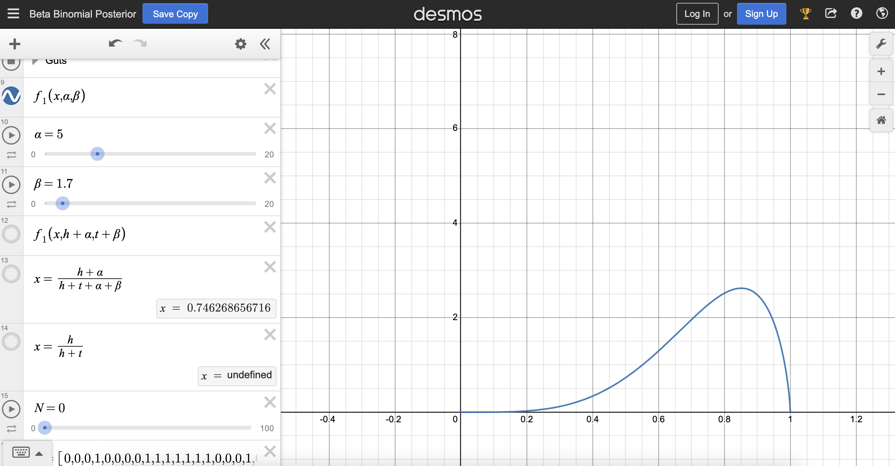
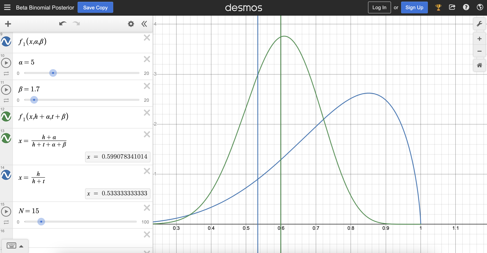

# Homework 22
## Question 1
In the context of a prior distribution for a proportion (
x, the proportion of voters supporting the candidate), a left-skewed distribution would indicate that higher values of x (i.e., a higher proportion of voters supporting the candidate) are more likely.

So I found the following parameters using the sliders:



In this case, the alpha is 5 and beta is 1.7. 

## Question 2
When N is 1 after observing the first data point, the posterior starts to become less left-skewed than when N is 0.

As N increases, the posterior becomes less skewed and tends towards a more symmetric, normal distribution.
The central line, representing the mode or peak of the distribution, decreases. 

## Question 3

When N is 15, the best guess from the Bayesian is 0.599, and the best guess from MLE solution is 0.533.

## Question 4
Increasing alpha will lead to a positive increase in both Bayesian and MLE estimation. Conversely, increasing beta will lead to a decrease in both Bayesian and MLE estimation of the best p.

## Question 5
Both estimates decrease when N is increased to 9, then increase when N is further increased to 15, decrease when N is increased to 18, then increase when N is increased to 19, and decrease when N is moved to 20, and further increase when N is moved to 21. 

After N is 21, both estimates decrease. After when N is 50, there're slight adjustments left and right to refine the best K around 0.25. 

## Question 6
I input 200 of total voters and 0.6 of the probability, here's the code to count the 0s and 1s in the series:
``````
p <- 0.6
N <- 200

bernoulli_series <- rbinom(N, 1, p)
count_0 <- sum(bernoulli_series == 0)
count_1 <- sum(bernoulli_series == 1)
count_0
count_1
``````
It turns out the total voters for the candidate is 118 (H), and the number of against voters is 82 (T).

Based on Bayesian estimation, the best p is 0.59.

## Question 7
As the number of data points increases, our estimate of approximately 59% support for the candidate using Bayesian methods becomes more precise and converges toward the true proportion (0.6). The Bayesian framework allows us to adapt our estimate as more data is collected, providing a more refined and accurate reflection of the underlying support for the candidate.