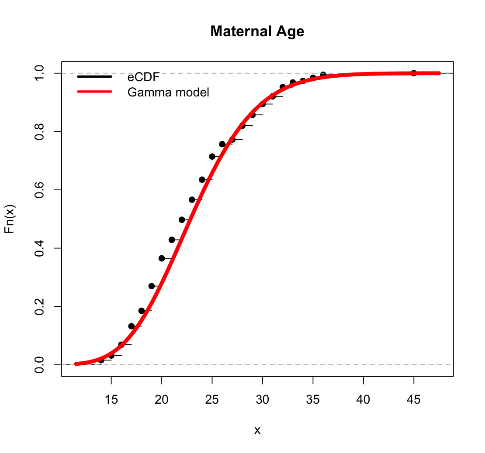
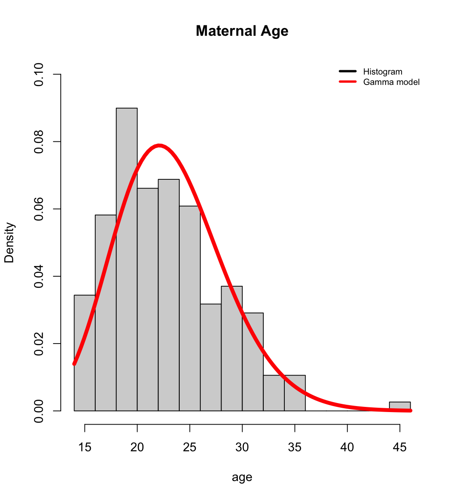

# Maximum likelihood estimation
I used the following code in R that uses the maximum likelihood to estimate the maternal age distribution:
``````
age <- MASS::birthwt$age

l<- function(shape,rate) -sum(dgamma(age,shape,rate,log=TRUE))

start_shape <- mean(age)^2/var(age)
start_rate <- mean(age)/var(age)
stats4::mle(l,list(shape=start_shape, rate=start_rate))

plot(ecdf(age), main = 'Maternal Age')
curve(pgamma(x, 20.2478, 0.8713),add=TRUE,col='red',lwd=5)
legend("topleft",legend = c('eCDF','Gamma model')
       , col = c('black','red'),lwd = 3, bty='n')

hist(age,freq=FALSE,main='Maternal Age',ylim=c(0,0.1), breaks=20)
curve(dgamma(x,20.2478, 0.871),add=TRUE,col = 'red',lwd=5)
legend("topright",legend = c('Histogram','Gamma model')
       , col = c('black','red'),lwd = 3, bty='n',cex = .7)
``````
Here're the plots generated:





Explanation:
I employed the maximum likelihood estimation (MLE) methodology to find the optimal parameters for a gamma distribution that would closely align with the maternal age dataset derived from the MASS::birthwt dataset. 

MLE serves as a statistical technique for determining the parameters of a probability distribution by maximizing the likelihood function, which gauges the probability of observing the given data under a specified distribution.

Initially, I extracted the maternal age data from the dataset and subsequently formulated a negative log-likelihood function tailored to the gamma distribution. This function encapsulates the mathematical representation of the compatibility between the gamma distribution, characterized by its shape and rate parameters, and the empirical maternal age data.

To initiate the optimization process, initial approximations for the shape and rate parameters were established based on the sample mean and variance of the maternal age. These initial values provided a foundational point for the MLE algorithm to iteratively refine the parameter estimates.


Subsequently, the stats4::mle function was employed to execute the maximum likelihood estimation. This function minimized the negative log-likelihood function with respect to the shape and rate parameters, yielding the optimal values that maximize the likelihood of observing the given maternal age data.

Following parameter estimation, I proceeded to visually represent the results through the creation of two distinct plots. The first plot depicted the empirical cumulative distribution function (eCDF) of maternal age, portraying the cumulative probability of age values. Overlaid on this plot was the gamma distribution curve, computed using the estimated shape and rate parameters.

The second plot featured a histogram of maternal age, providing a graphical illustration of the frequency distribution of age values. Overlaid on this histogram was the gamma distribution curve, once again leveraging the estimated parameters.
