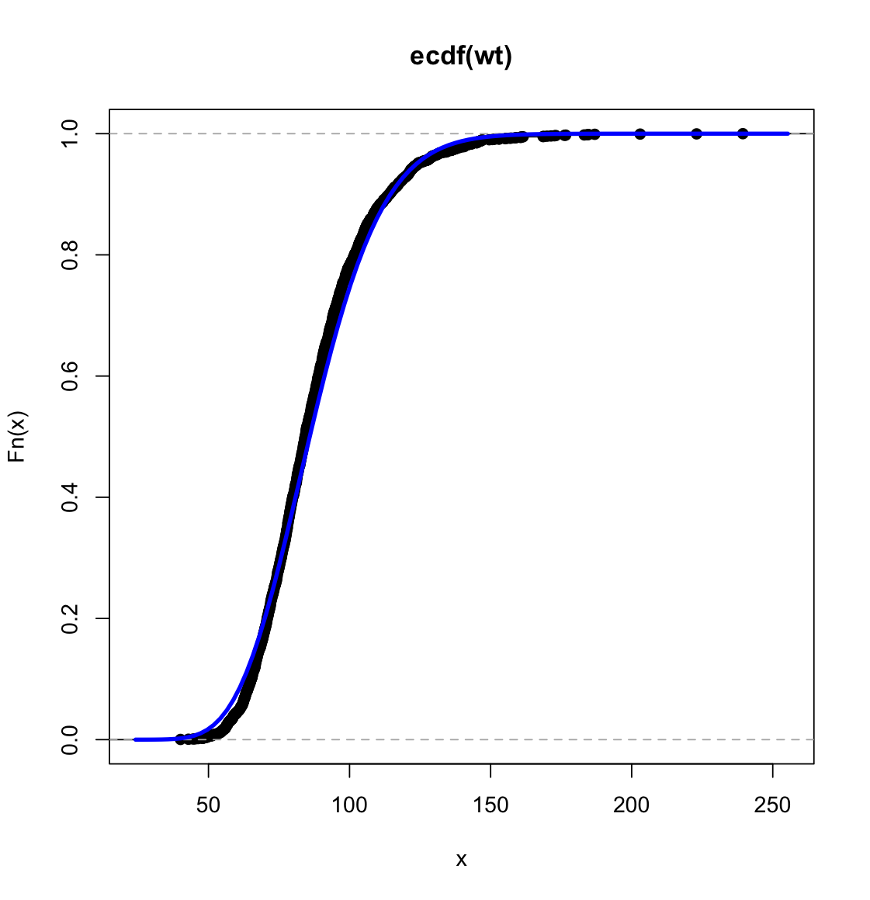
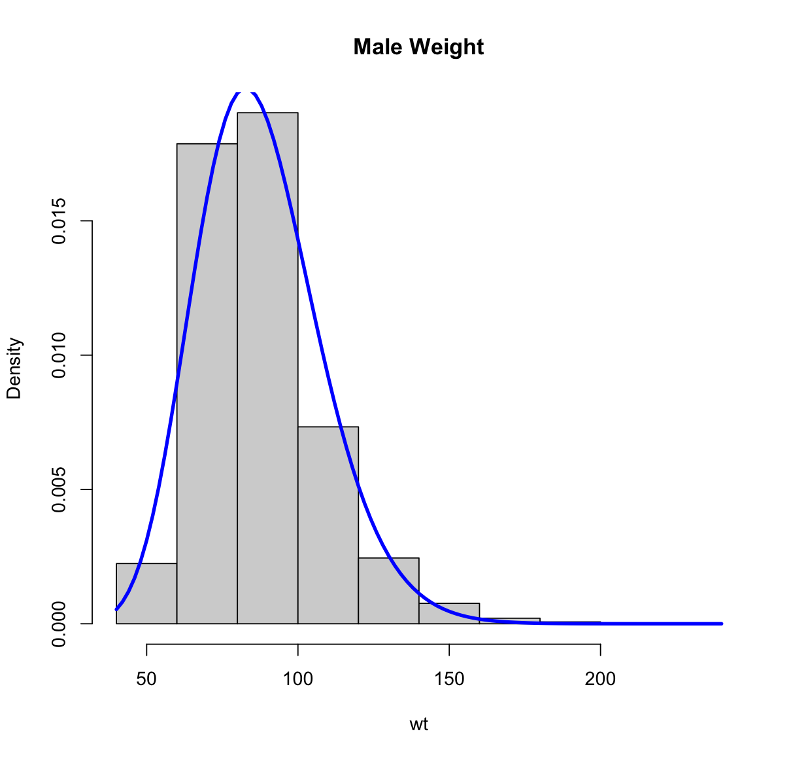

# Methods of Moments
I used the following code to generate two plots:
``````
Hmisc::getHdata(nhgh)
require(dplyr)

weight <- nhgh %>% 
  filter(age >= 18) %>% 
  filter(sex == "male")
wt <- weight$wt

xbar <- mean(wt)
s2 <- var(wt)
shape_hat <- xbar^2/s2
scale_hat <- s2/xbar

Fwt <- function(x){
  pgamma(x,shape=shape_hat,scale=scale_hat)
}

plot(ecdf(wt))
curve(Fwt(x),add=TRUE,col='blue',lwd=3,main='Male Weight')

fwt <- function(x){dgamma(x, shape = shape_hat, scale = scale_hat)}
hist(wt, freq = FALSE, main = "Male Weight")
curve(fwt(x), add = TRUE, col = "blue", lwd = 3, main = "Male Weight")
``````





Explanation:

For this assignment, I employed the method of moments to analyze and visualize the weight distribution among adult males using the provided code. 

I began by loading the necessary packages, namely `Hmisc` and `dplyr`, and filtered the dataset to focus on adult males aged 18 and above. The weights of these individuals were then extracted into the variable `wt`.

Then I computed method of moments estimates for the shape and scale parameters of the gamma distribution. The estimates were derived from the sample mean (`xbar`) and sample variance (`s2`). Specifically, the estimated shape (`shape_hat`) was calculated as the square of the mean divided by the variance, while the estimated scale (`scale_hat`) was determined as the variance divided by the mean.

Subsequently, I defined a cumulative distribution function (`Fwt`) and a probability density function (`fwt`) for the gamma distribution using the estimated shape and scale parameters. These functions were then employed to generate two distinct plots to visualize the weight distribution among adult males.

In the first plot, I used the `plot` function to display the empirical cumulative distribution function (eCDF) of male weights. The second plot utilized the `hist` function to create a histogram illustrating the frequency distribution of male weights. Similar to the first plot, the `curve` function was employed to overlay the gamma distribution curve.

Both plots serve as visual aids to assess how well the gamma distribution, characterized by the method of moments estimates, aligns with the observed weight distribution among adult males. The blue curves in each plot provide a graphical representation of the estimated gamma distribution, allowing for insights into the goodness of fit to the empirical data.