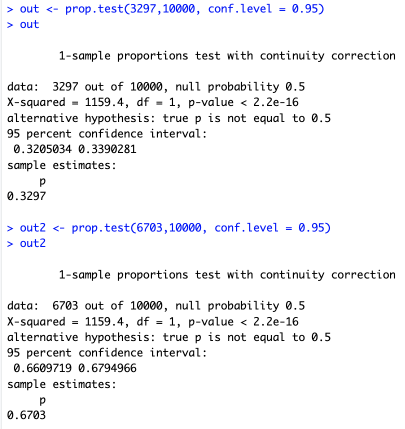
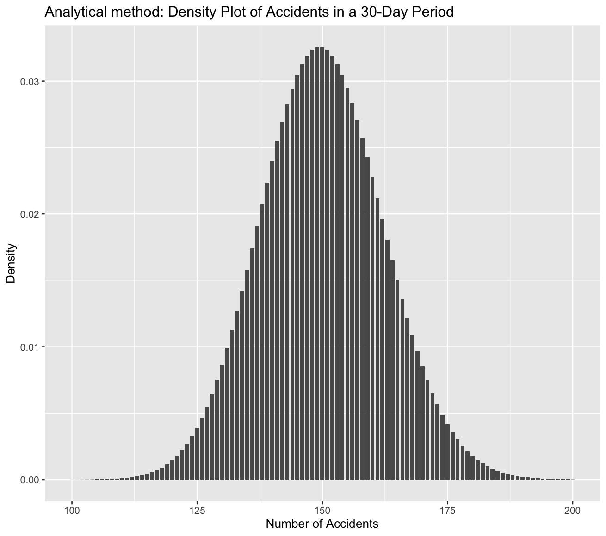
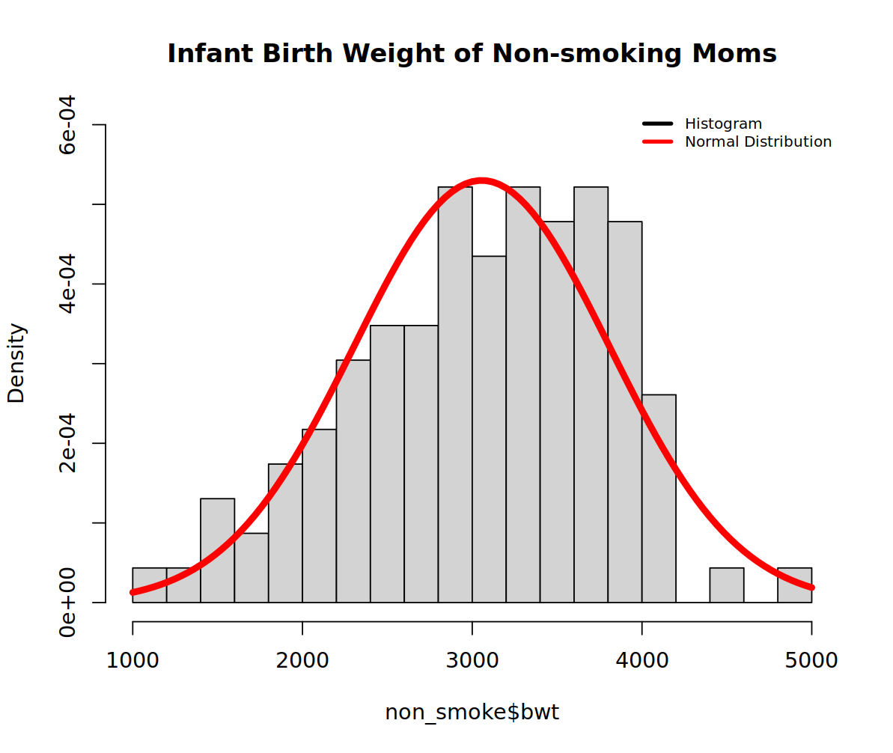
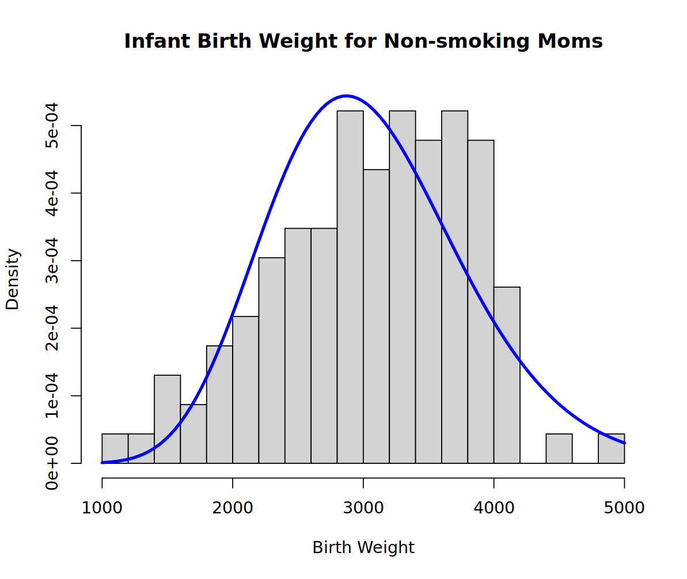
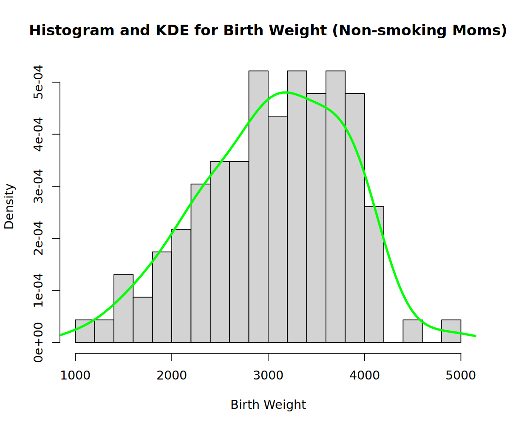

# DS 2006 Final Practice Exam
- **Name**: Leyan Tang
- **ComputingID**: gnv2nh
- **Date**: December 13th, 2023

## 1. The Monty Hall Problem
**A. Strategy 1 wining probability with equal prize assignment**

P(winning a car) = 1/3. When the person made the initial decision to choose door A, there's 1/3 probability that the chosen door has the car and 2/3 probability that the chosen door contains goat because of the assumption that the prize assignment is equal across these three doors. Now, even the host reveals a door B that contains a goat, the initial probabilities still remain unchanged.

However, the for strategy 2, the probabilities to win a car by switching is 2/3. This is because by revealing the goat in another door, the host reassigns the probabilities from that from original one of the goat door to the remaining unopen goat door, making it to have the probability of 2/3, while the original chosen door's probability remains the same of 1/3.

Therefore, the probability of switching is always higher than the initial choise because the host's action updates the information about the location of the car, and the contestant can capitalize on this by switching doors. The probabilities favor the unopened door, making the switching strategy more likely to result in winning the car compared to sticking with the initial choice.

**B. Winning probabilities using R Simulations**
Based on the game function, I ran 10000 simulations and calculated the probabilities for two strategies with random prize assignments:

``````
num_simulations <- 10000
wins_staying <- 0
wins_switching <- 0

for (i in 1:num_simulations) {
  results <- game()
  wins_staying <- wins_staying + (results[1] == "car")
  wins_switching <- wins_switching + (results[2] == "car")
}

prob_staying <- wins_staying / num_simulations
prob_switching <- wins_switching / num_simulations

cat("Strategy 1:", prob_staying, "\n")
cat("Strategy 2:", prob_switching, "\n")
``````
Based on the simulation, probability of winning the car with strategy 1 is 0.3332, and probability of winning the car with strategy 2 is 0.6668, which closely corresponds to the mathematical methods in step A.

**C. Communicating uncertainty**

The Central Limit Theorem states that, with a sufficiently large sample size, the distribution of sample means from any population approaches a normal distribution. In this case, I was assuming that with a sample number of 10000, the sample dsitrbution is close to normal distribution for calculating the intervals.

Using the following CLT shortcut, I calculated the interval for both strategies:
``````
d1 <- replicate(10000, game())
mean <- rowMeans(d1 == "car")
sum <- rowSums(d1 == "car")
out1 <- prop.test(3297,10000, conf.level = 0.95)
out1
out2 <- prop.test(6703,10000, conf.level = 0.95)
out2
``````



Generating 10000 number of simulations, there's 3297 wins for strategy 1 and 6703 wins for strategy 2, calculated by rowMeans. Based on the intervals, we're 95% confident that the true probability of winning with Strategy 1 falls within 0.3205 and 0.3390, and 95% confident that the true probability of winning with Strategy 2 falls within 0.6610 and 0.6795.

## 2. Conditional Probability
**A. Probability Table**
|             | D+    | D- | Margin  |
| ----------- | ----------- | ----------- | ----------- |
| **T+** | 0.0008    | 0.0999    | 0.1007 |
| &nbsp;&nbsp;&nbsp; Row |0.0079| 0.9921  | |
| &nbsp;&nbsp;&nbsp; Col | 0.8 | 0.1  | |
| **T-** | 0.0002  |0.8991   | 0.8993 |
| &nbsp;&nbsp;&nbsp; Row | 0.0002  | 0.9998  | |
| &nbsp;&nbsp;&nbsp; Col | 0.2 |0.9 | |
| Margin | 0.001  | 0.999   | 1 |

**B. Positive predictive value of the test**
Based on Bayes' Rule, P(D+|T+) can be calculate as P(T+|D+)*P(D+)/P(T+), which is `0.00794439`, as is shown in the row probability on the top left cell.

**C. Calculation of p when P(D+|T+) is 0.5**
If `P(T+|D+) = P(T-|D-) = p`, the key components consisting of are calculated as:

- P(T+|D+) = p
- P(D+) = 0.001
- P(T+) = 0.001*p + 0.999*(1-p) = 0.999-0.998*p

So then the equation of the positive predictive value is p*0.001/(0.999-0.998*p). Equating it to be 0.5, the required p is `0.999`.

## 3. Discrete Distributions
**A. 90th percentile for the number of car accidents**

Using the following code, I calculated that the 90th percentile is 8 accidents per day:
``````
percentile_90 <- qpois(0.9, lambda = 5)
``````

**B. Density Plot**
Using the code as below, I generated the density plot:
``````
accident_counts <- seq(100, 200, by = 1)
density <- dpois(accident_counts, lambda =  5*30)

ggplot(data = data.frame(x = accident_counts, y = density), aes(x, y)) +
  geom_bar(stat = "identity",width = 0.8) +
  labs(title = "Analytical method: Density Plot of Accidents in a 30-Day Period",
       x = "Number of Accidents",
       y = "Density")
``````



**C. Probability of observing 180 or more accidents in a 30 day period**

Using `prob_180_or_more <- 1 - ppois(180 - 1, lambda = 5*30)`, I calculated that this tail probability to be `0.009417947`.


## 4. Continuous Distributions
**A. Probability of DBP lying between 90 and 110 mmHg**

Using `prob <- pnorm(110, mean=80, sd=15) - pnorm(90, mean=80, sd=15)`, I calculated the probability in between is `0.2297424`.

**B. Probability that the discovered femor was from a male**

Given the Bayes' Rule, P(male|discovered) = P(discovered|male) * P(male) / P(discovered).

Since we know P(male) is 0.5 so we only need to calculate the remaining two components, where P(discovered) = P(discovered|male)*P(male) + P(discovered|female)*P(female).

Using this following code, I calculated that the probability that the discovered femor was from a male is  `0.6692436`:

``````
prob_male <- dnorm(40, mean = 40, sd = 3.4) * 0.5 /
  (dnorm(40, mean = 40, sd = 3.4) * 0.5 +
   dnorm(40, mean = 36, sd = 3.3) * 0.5)
prob_male
``````

**C. Probability that 2 or more patients in a cohort of 10 experience an infection within 30 days**

I used the follwing simulation code to calculate this probability:
``````
num_simulations <- 100000
simulated_results <- numeric(num_simulations)

for (i in 1:num_simulations) {
  p_simu <- rbeta(1, 10, 100)
  infections_simulation <- rbinom(1, size = 10, prob = p_simu)
  simulated_results[i] <- infections_simulation >= 2
}

simulated_probability <- mean(simulated_results)
simulated_probability
``````
- The probability is `0.23197`.
- Explanation:

I set the number of simulations to 100,000 initially because p is the random assignment. To keep track of the outcomes, I initialized a vector named `simulated_results`. Throughout the simulation process, I calculated whether in each iteration 2 or more patients in the cohort experienced an infection and recorded the result in the `simulated_results` vector.

For each simulation, I generated a random value of \( p \) from a beta distribution with parameters \(\alpha = 10\) and \(\beta = 100\). I then used a negative binomial distribution to simulate the number of infections in a cohort of 10 patients, considering each patient's individual risk (\( p \)).

After completing all simulations, I calculated the simulated probability by taking the mean of the `simulated_results` vector. This provided the proportion of simulations where 2 or more patients in the cohort experienced an infection within 30 days.

## 5. CDF and PDF
**A. MLE Method**

Code used:
``````
wt <- MASS::birthwt
non_smoke <- subset(wt, smoke == 0)

mean <- mean(non_smoke$bwt)
sd <- sd(non_smoke$bwt)

hist(non_smoke$bwt, freq = FALSE, main = 'Infant Birth Weight of Non-smoking Moms', ylim=c(0,0.0006), breaks=20)
curve(dnorm(x, mean = mean, sd = sd), add = TRUE, col = 'red', lwd = 5)
legend("topright", legend = c('Histogram', 'Normal Distribution'),
       col = c('black', 'red'), lwd = 3, bty = 'n', cex = 0.7)
``````
Plot:



**B. Gamma Distribution**

Code used:
``````
wt <- MASS::birthwt
non_smoke <- subset(wt, smoke == 0)
bwt <- non_smoke$bwt

xbar <- mean(bwt)
s2 <- var(bwt)
shape_hat <- xbar^2 / s2
scale_hat <- s2 / xbar

fwt <- function(x) {
  dgamma(x, shape = shape_hat, scale = scale_hat)
}


hist(bwt, freq = FALSE, main = "Infant Birth Weight for Non-smoking Moms",
     xlab = "Birth Weight", ylab = "Density", 
     ylim = c(0, max(fwt(bwt))), breaks = 20)
curve(fwt(x), add = TRUE, col = "blue", lwd = 3)
``````
Plot:



**C. Gaussian kernel**

Code used:
``````
wt <- MASS::birthwt
non_smoke <- subset(wt, smoke == 0)
bwt <- non_smoke$bwt

kde <- density(bwt, kernel = "gaussian")

hist(bwt, freq = FALSE, main = "Histogram and KDE for Birth Weight (Non-smoking Moms)",
     xlab = "Birth Weight", ylab = "Density", col = "lightgray",
     breaks = 20)
lines(kde, col = "green", lwd = 3)

``````
Plot:



## 6. Uncertainty about estimates
**A. 1/20 support interval**
Based on the image, the support interval ranges is where the "1/20" horizontal line converges with the standardized likelihood. So by eye, the interval is around `[2930, 3230]`. 

**B. Symmetric density credible interval**
I used the following code to calculate the credibal interval:

``````
mean <- 3100
sd <- sqrt(10)

quantile_lower <- qnorm(0.025, mean = mean, sd = sd)
quantile_upper <- qnorm(0.975, mean = mean, sd = sd)

credible_interval <- c(quantile_lower, quantile_upper)
credible_interval
``````

And the interval is `[3093.802, 3106.198]`.


## 7. Misc Definitions
A. What is a confounding variable?
- Answer: A confounding variable is an additional variable in a study that correlates with both the independent variable and the dependent variable. For instance, in a research project investigating the impact of a new teaching method on student performance, socioeconomic status could be a confounding variable if it influences both the teaching method used and the students' academic outcomes, making it challenging to attribute any observed changes solely to the new teaching approach.

B. What is a CDF?
- Answer: The Cumulative Distribution Function (CDF) is a way of summing up probabilities to tell us the chance that a random variable is less than or equal to a certain value. It's non-decreasing meaning that it only stays the same or increase. It has a range of 0 to 1.

C. What is a PDF? PMF?
- Answer: 
The Probability Density Function (PDF) is to express the probability per unit of the variable for a continuous random variable. Specifically, for a continuous variable X, the PDF f(x), provides the relative likelihood of X taking on a particular value or falling within a given range. 

The Probability Mass Function (PMF) is a concept applied to discrete random variables, providing the absolute probability of the variable assuming a specific value. For a discrete variable X, the PMF P(X=x), directly gives the probability associated with each possible outcome. The sum of all PMF values across all possible outcomes is always 1, and the PMF gives absolute probabilities for each specific outcome of the discrete variable.

D. What is Simpson’s Paradox?
- Answer: Simpson's Paradox occurs when a trend or association observed in different groups of data disappears or reverses when the groups are combined. It emphasizes the importance of considering subgroup details rather than relying solely on overall summaries. The paradox can arise when confounding variables are not appropriately considered, leading to misleading or incorrect conclusions.

E. What is independence?
- Answer: Independence means that the probability of one event does not affect the probability of the other. Two random variables are considered independent if the knowledge or information about the value of one variable provides no information about the value of the other variable.
