# DS 2006 Final Exam
- **Name**: Leyan Tang
- **ComputingID**: gnv2nh
- **Date**: 11:30AM, December 13th, 2023

## 0. Rules of probability
### A. Probability table
|             | Depression score < 13   | Depression score >= 13 | All  |
| ----------- | ----------- | ----------- | ----------- |
| **Planned vaginal delivery** | 0.864   | 0.096   | 0.96 |
| Row |0.9| 0.1  | |
| Col | 0.96 | 0.96  | |
| **Planned caesarean section delivery** | 0.036  |0.004   | 0.04 |
| Row | 0.9  | 0.1  | |
| Col | 0.04 |0.04 | |
| **All** | 0.9  |  0.1  | 1 |

### B. Table update 1
|             | Depression score < 13   | Depression score >= 13 | All  |
| ----------- | ----------- | ----------- | ----------- |
| **Planned vaginal delivery** | 0.63    | 0.07    | 0.7 |
| Row |0.9| 0.1  | |
| Col | 0.7 | 0.7  | |
| **Planned caesarean section delivery** | 0.27  |0.03   | 0.3 |
| Row | 0.9  | 0.1  | |
| Col | 0.3 |0.3 | |
| **All** | 0.9  | 0.1  | 1 |

### C. Table update 2
|             | Depression score < 13   | Depression score >= 13 | All  |
| ----------- | ----------- | ----------- | ----------- |
| **Planned vaginal delivery** | 0.63    | 0.07    | 0.7 |
| Row |0.9| 0.1  | |
| Col | 0.71 | 0.61  | |
| **Planned caesarean section delivery** | 0.255  |0.045   | 0.3 |
| Row | 0.85  | 0.15  | |
| Col | 0.29 |0.39 | |
| **All** | 0.885 | 0.115  | 1 |

### D.Validation
No, the data that match the depression rates could not illustrate the reasoning that the caesarean section delivery leads to higher rates of depression. This is because the data are collected based on the prior belief that within the caesarean section method there's a higher depression rate (15%) already compared with the vaginal delivery (10%), and the unequal split of the two groups (7:3) further makes the caesarean seem higher in the depression rate as it has less significant representation. 

Additionally, there might be other confounding with other factors that haven't be explored, so controlled experiments need to be run based on some fixed factors to draw a concrete conclusion, instead of relying merely on the observational data. For example, such factors may be relevant with the health conditions, age groups, regions of the mother that planned the delivery methods.

## 1. Simulation
### A. Probability that both strategies simultaneously result in a goat
``````
num_simulations <- 2^16
simulations <- replicate(num_simulations, game(4))
both_goat_prob <- mean(simulations[1,] == "goat" & simulations[2,] == "goat")

both_goat_prob
``````

The simulation result of the probability that both strategies simultaneously result in a goat is `0.3742065`.

### B. Reporting precision
Given that the number of simulations is 2^16 (65536), pinpointing this on the x-axis in the absolute/relative error plot which is 16 because it is on a log2 scale, we can identify the absolute/relative error of the simulation compared to the true value. Since the true probability of both resulting in goat is 3/8 when N is 4, the p is 0.375 in the analytic solution.

- The absolute error is between 0.09 and 0.10 when N is 16 and p is between 0.25 and 0.50.
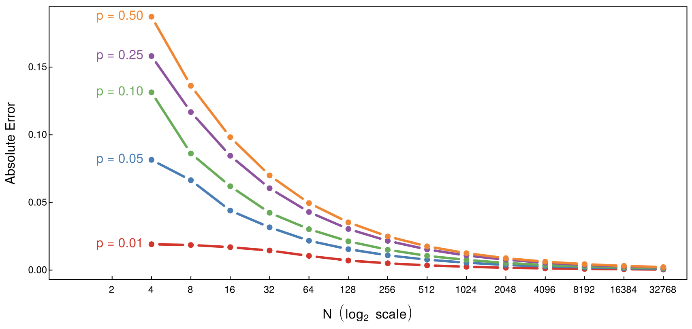

- The relative error is between 0.03 and 0.04 when N is 16 and p is between 0.25 and 0.5.
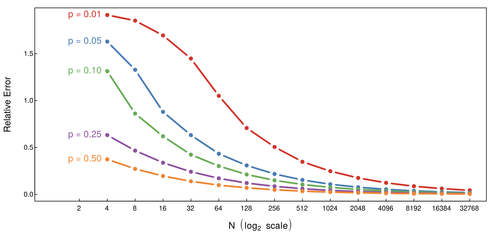

### C. Analytic solution: Contingency Table
``````
num_simulations <- 2^16
simulations <- replicate(num_simulations, game(4))
both_goat_prob <- mean(simulations[1,] == "goat" & simulations[2,] == "goat")
both_car_prob <- mean(simulations[1,] == "car" & simulations[2,] == "car")
car_1_goat_2 <- mean(simulations[1,] == "car" & simulations[2,] == "goat")
car_2_goat_1 <- mean(simulations[1,] == "goat" & simulations[2,] == "car")

both_goat_prob
both_car_prob
car_1_goat_2
car_2_goat_1
``````
| | | Strategy 2 | |
|:---|:---|:---:|:---:|
| | | Car | Goat |
| **Strategy 1** | Car | 0 (0) | 0.2507019 (0.25) |
| | Goat| 0.3777313 (0.375) | 0.3715668 (0.375) |

## 2. Diagnostics
### A. Probability table
|             | D+    | D- | Margin  |
| ----------- | ----------- | ----------- | ----------- |
| **T+** | 0.00085    | 0.04995    | 0.0508 |
| Row |0.0167| 0.9833  | |
| Col | 0.85 | 0.05  | |
| **T-** | 0.00015  |0.94905   | 0.9492 |
| Row | 0.00016  | 0.99984  | |
| Col | 0.15 |0.95 | |
| Margin | 0.001  | 0.999   | 1 |

### B. Negative predictive value
Based on the table above, P(D-|T-) is the row probability of `0.99984`.

### C. Positive predictive value

Based on the table, I calculated that P(D+|T+) is 0.85\*P(D+)/(0.05 + 0.8\*P(D+)), and the plot is as below:

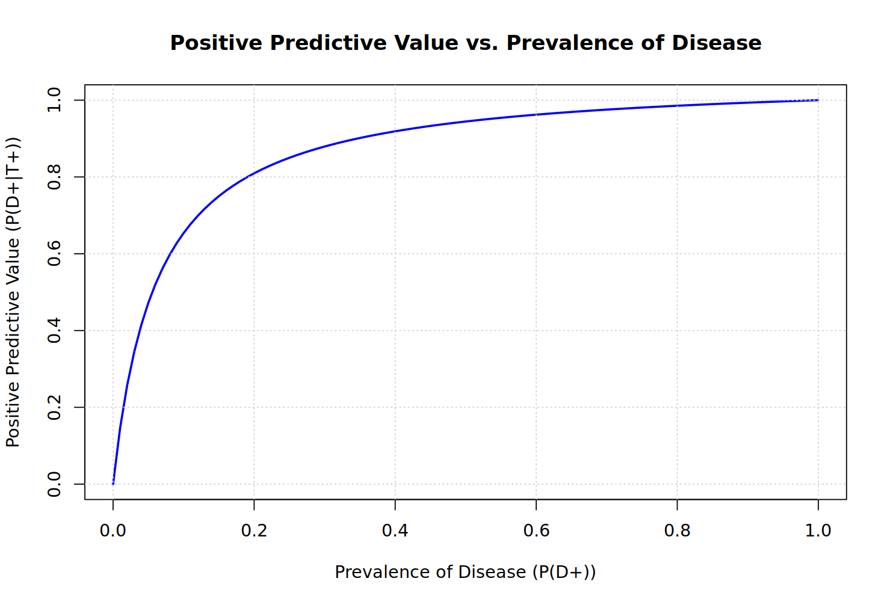

## 3. Mixture Distributions
### A. 90th percentile
I used the following code to calculate the 90th percentile, since the simulation method is easier:
``````
rhc <- function(n){ rgamma(n,shape=2,scale=2)*rbinom(n,1,.4) }
simulations <- rhc(1000)
percentile_90_sim <- quantile(simulations, 0.9)
print(percentile_90_sim)
``````
The computed result is `5.340455` based on 1000 simulations. 

### B. Class average yearly hospital charge
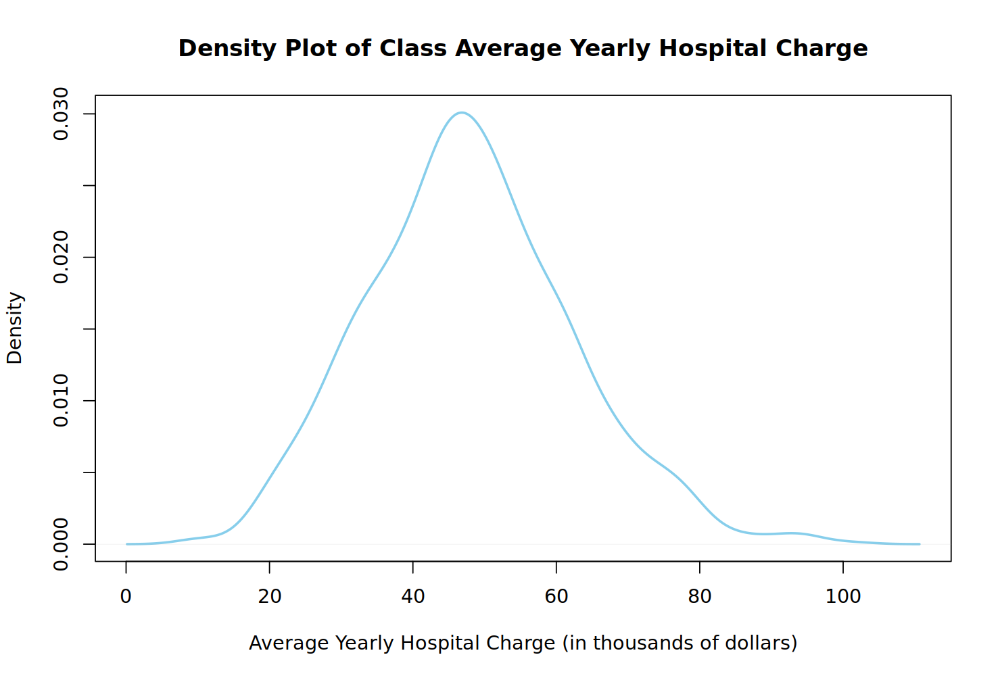

Here's the code that I used for this density plot:
``````
class_size <- 30
num_classes <- 1000
charges_per_student <- rhc(class_size * num_classes)

class_average_charges <- tapply(charges_per_student, rep(1:num_classes, each = class_size), mean)
class_average_charges <- class_average_charges * class_size

density <- density(class_average_charges)
plot(density, main = "Density Plot of Class Average Yearly Hospital Charge",
     xlab = "Average Yearly Hospital Charge (in thousands of dollars)", col = "skyblue", lwd = 2)
``````
As I chose the total number of classes to be 1000, I first calculated the average charge per student for each class and then timed the class size of 30 for the class average number for all 1000 classes, and then generated the plot.

### C. Probability of less than 10 students with zero charges

Following the simulation method in B, I increased the class number to be 10000, and looping through each class to calculate the number of 0-charge students. Finally, out of the loop, I calculated the probability of less than 1/3 students having zero charges in a randomly selected class to be `0.001`.
``````
class_size <- 30
num_classes <- 10000
charges_per_student <- rhc(class_size * num_classes)
charges_matrix <- matrix(charges_per_student, nrow = num_classes, byrow = TRUE)

count_less_than_third <- 0
for (i in 1:num_classes) {
  count_zero_charges <- sum(charges_matrix[i, ] == 0)
  if (count_zero_charges < class_size / 3) {
    count_less_than_third <- count_less_than_third + 1
  }
}

probability_less_than_third <- count_less_than_third / num_classes
print(probability_less_than_third)
``````
## 4. Continuous Distributions
### A. Probability of DBP exceeding 114 mmHg
Using the following code:
``````
prob <- 1 - pnorm(104, mean = 80, sd = 15)
prob
``````
So the probability of DBP exceeding 114 mmHg is `0.05479929`.

### B. Probability that discovered femur was from a male

Given the Bayes' Rule, P(male|discovered) = P(discovered|male) * P(male) / P(discovered).

Since we know P(male) is 0.5 so we only need to calculate the remaining two components, where P(discovered) = P(discovered|male)*P(male) + P(discovered|female)*P(female).

Using this following code, I calculated that the probability that the discovered femor was from a male is `0.407765`:
``````
prob_male <- dnorm(37, mean = 40, sd = 3.4) * 0.5 /
  (dnorm(37, mean = 40, sd = 3.4) * 0.5 +
   dnorm(37, mean = 36, sd = 3.3) * 0.5)
prob_male
``````
### C. Value of x
Following the logic in B, if the two probabilities are equal, then I used the following code to pinpoint the intersected x value while plotting out the two density function for female and male:
``````
x <- seq(25, 50, length.out = 10000)
prob_male <- dnorm(x, mean = 40, sd = 3.4) * 0.5 /
  (dnorm(x, mean = 40, sd = 3.4) * 0.5 +
   dnorm(x, mean = 36, sd = 3.3) * 0.5)

prob_female <- dnorm(x, mean = 36, sd = 3.3) * 0.5 /
  (dnorm(x, mean = 40, sd = 3.4) * 0.5 +
   dnorm(x, mean = 36, sd = 3.3) * 0.5)

intersection_x <- x[which.min(abs(prob_male - prob_female))]
intersection_y <- prob_male[which.min(abs(prob_male - prob_female))]

plot(x, prob_male, type = "l", col = "blue", lwd = 2, ylim = c(0, 1), ylab = "Probability", xlab = "Value")
lines(x, prob_female, col = "red", lwd = 2)
legend("topright", legend = c("Male", "Female"), col = c("blue", "red"), lwd = 2)

abline(v = intersection_x, col = "green", lty = 2)
points(intersection_x, intersection_y, col = "green", pch = 19)
cat("Intersection at x =", intersection_x, "\n")
title("Probability Density Functions for Male and Female")
``````
The calculated intersection is when x is approximately `38.05`, P(femur from male | femur length = x) = P(femur from female | femur length = x).


## 5. Empirical CDF
### A. CDF plot
Using the simulation and eCDF method, I plotted the CDF for yearly charge per student:
``````
rhc <- function(n) {
  rgamma(n, shape = 2, scale = 2) * rbinom(n, 1, 0.4)
}

sim_data <- rhc(100000)
ecdf_values <- ecdf(sim_data)
x_values <- seq(min(sim_data), max(sim_data), length.out = 1000)
y_values <- ecdf_values(x_values)

plot(x_values, y_values, type = "l", col = "blue", lwd = 2,
     main = "Empirical Cumulative Distribution Function (eCDF)",
     xlab = "Yearly Hospital Charges (in thousands of dollars)",
     ylab = "Cumulative Probability")
``````
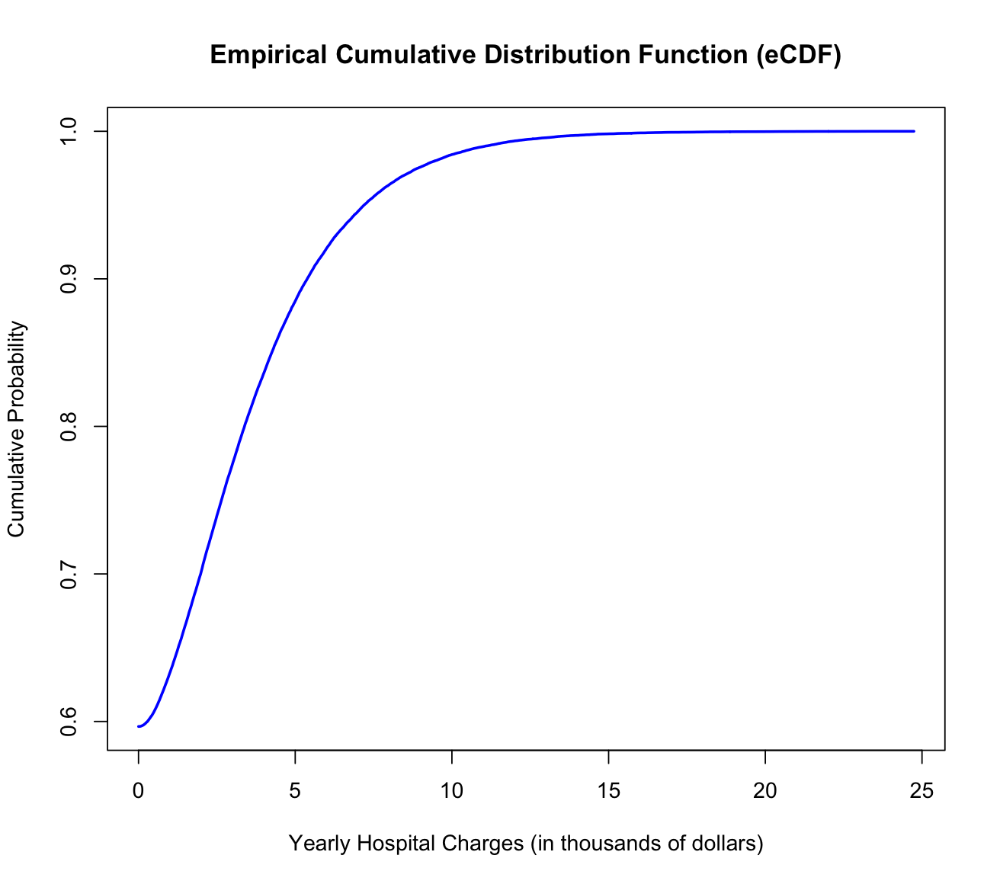

### B. Yearly charge CDF with a cap
``````
rhc_capped <- function(n) {
  charges <- rgamma(n, shape = 2, scale = 2) * rbinom(n, 1, 0.4)
  charges[charges > 1.5] <- 1.5
  return(charges)
}


sim_data_capped <- rhc_capped(10000)
ecdf_values_capped <- ecdf(sim_data_capped)
x_values_capped <- seq(min(sim_data_capped), max(sim_data_capped), length.out = 10000)
y_values_capped <- ecdf_values_capped(x_values_capped)

plot(x_values_capped, y_values_capped, type = "l", col = "red", lwd = 2,
     main = "Empirical Cumulative Distribution Function (eCDF) with Cap",
     xlab = "Yearly Hospital Charges (in thousands of dollars)",
     ylab = "Cumulative Probability")
``````
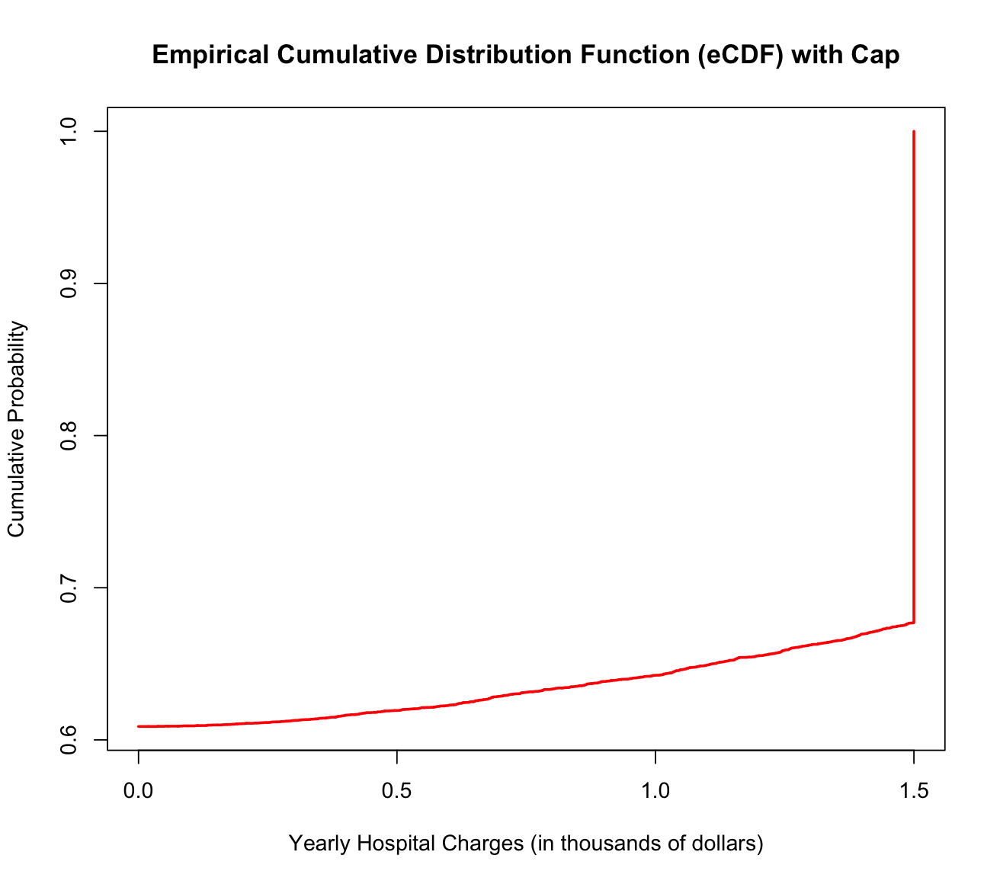

### C. Median yearly hospital charge

Based on B, I calculated the median based on the simulated result on 10000 students: `summary(sim_data_capped)`, and the median of yearly hospital charge is **0**.

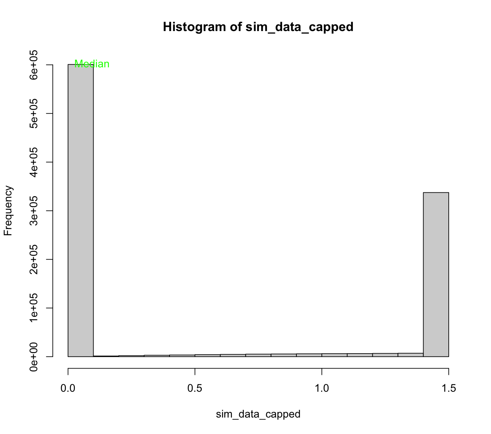

## 6. Estimation of CDF and PDF from data
### A. MLE method
``````
df <- Hmisc::getHdata(nhgh)
d1 <- nhgh[1:500,]
adult_males <- d1[d1$age > 18 & d1$sex == "male", ]
mean_value <- mean(adult_males$ht)
sd_value <- sd(adult_males$ht)

hist(adult_males$ht, freq = FALSE, main = 'Estimated Density Function of Standing Height for Adult Males', ylim = c(0, 0.06), breaks = 20)
curve(dnorm(x, mean = mean_value, sd = sd_value), add = TRUE, col = 'red', lwd = 2)

legend("topright", legend = c('Histogram', 'Normal Distribution'),
       col = c('black', 'red'), lwd = 2, bty = 'n', cex = 0.7)
``````
Plot: 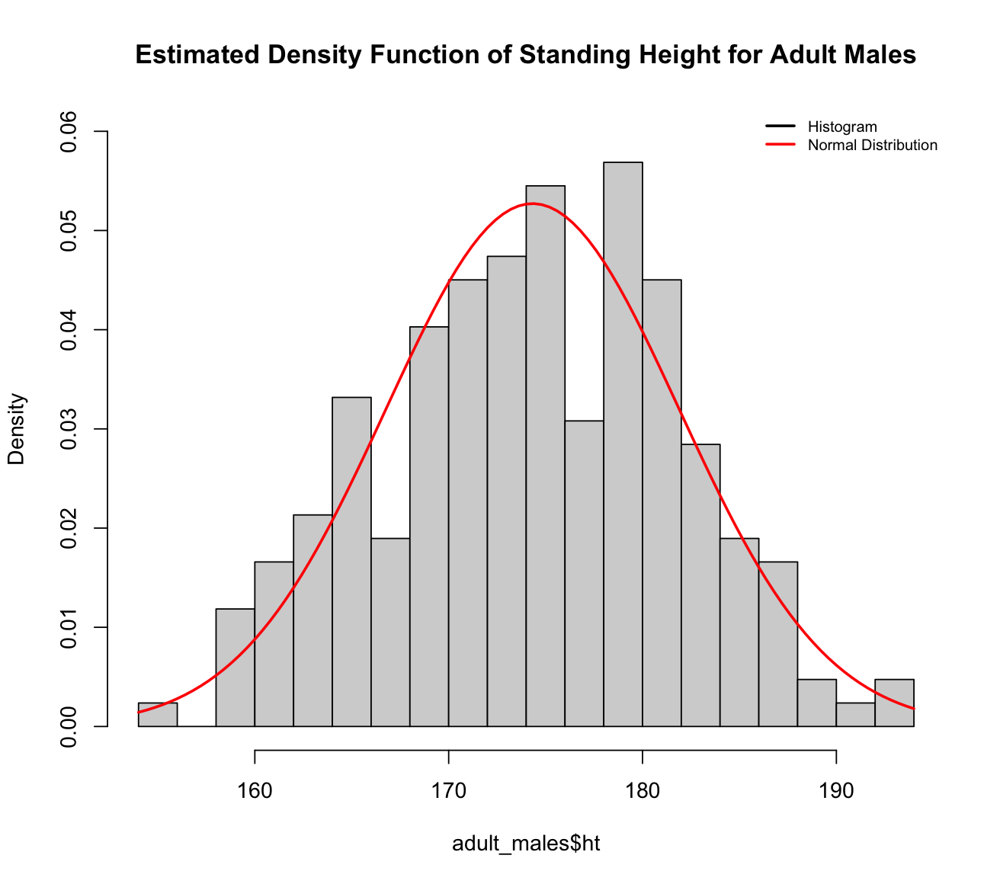

### B. Method of moment
``````
df <- Hmisc::getHdata(nhgh)
d1 <- nhgh[1:500,]
adult_females <- d1[d1$age > 18 & d1$sex == "female", ]
bmi <- adult_females$bmi

xbar <- mean(bmi)
s2 <- var(bmi)
shape_hat <- xbar^2 / s2
scale_hat <- s2 / xbar

fbmi <- function(x) {
  dgamma(x, shape = shape_hat, scale = scale_hat)
}

hist(bmi, freq = FALSE, main = "Estimated Density Function of BMI for Adult Females",
     xlab = "BMI", ylab = "Density", breaks = 20)
curve(fbmi(x), add = TRUE, col = "blue", lwd = 3)
``````
Plot: 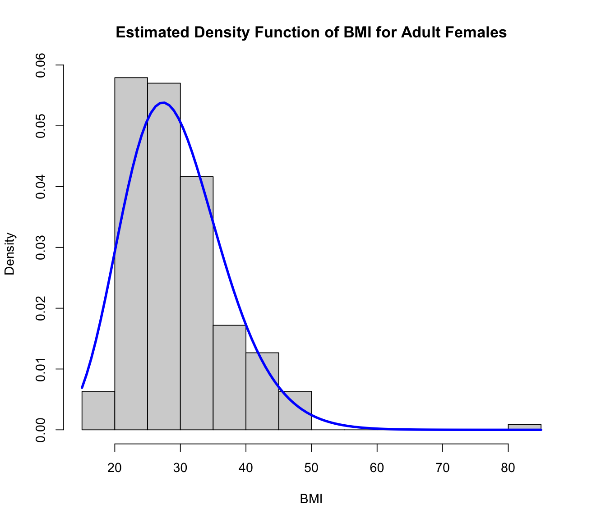
### C. Kernal density method
``````
adults <- d1[d1$age > 18, ]
scr <- adults$SCr
kde <- density(scr, kernel = "gaussian", na.rm = TRUE)

plot(kde, main = "Kernel Density Estimate of SCr for Adults",
     xlab = "Serum Creatinine (SCr)", ylab = "Density", col = "green", lwd = 3)
legend("topright", legend = "Kernel Density Estimate",
       col = "green", lwd = 3, bty = 'n', cex = 0.8)
``````
Plot: 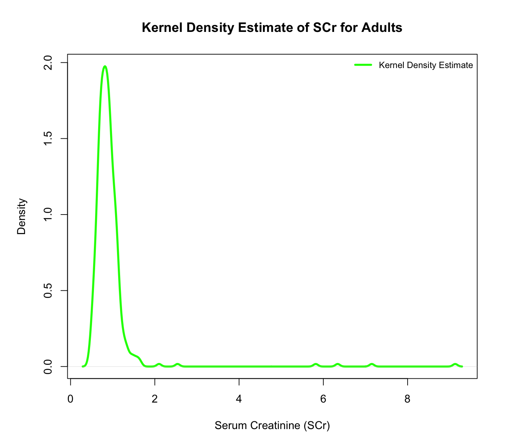
### D. Bayesian updating
From the data, I calculated that there're 421 zeroes and 79 ones. Therefore, I plugged in H to be 421 and T to be 79. When α is 290, β is 65, the posterior fits the prior the most.

Plot: 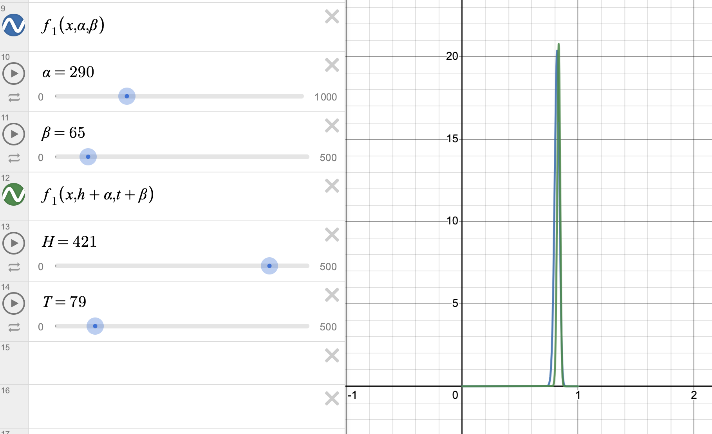

### E. Informative prior
Even though in D, the posterior fits the prior the most, it is still not fit the left side perfectly. So in order to create a more informative prior, I retrieved 1000 rows from the dataset and calculate the numbers again. Now H is 853 and T is 147.The expanded dataset and more precise parameters resulted in a more fit posterior curve, when α is 680, β is 84.

Plot: 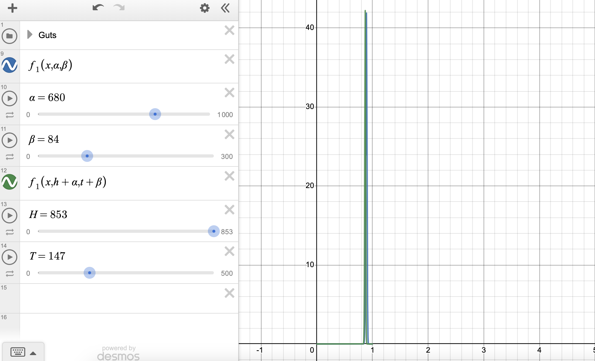

## 7. Communicating uncertainty about parameter estimates
### A. Support Interval: Maximum Likelihood
Based on the image, the support interval ranges is where the "1/20" horizontal line converges with the normalized maximum likelihood function. So by eye, the interval is around `[2930, 3230]`.

The interval [2930, 3230] is wider than the intervals corresponding to 1/10 and 1/5. As we move from 1/20 to 1/10 and 1/5, the likelihood of the true mean falling within a more confined range becomes higher. This is because a narrower interval suggests that the estimated mean is more precisely determined, reducing the range of potential values and, consequently, increasing our confidence in the accuracy of the estimate. The process reflects a refinement of our understanding of the average baby weight as we incorporate more information from the data.

### B. Credibal Interval: Bayesian Updating
I used the following code to calculate the credibal interval:

``````
mean <- 3100
sd <- sqrt(10)

quantile_lower <- qnorm(0.025, mean = mean, sd = sd)
quantile_upper <- qnorm(0.975, mean = mean, sd = sd)

credible_interval <- c(quantile_lower, quantile_upper)
credible_interval
``````

A 95% symmetric density credible interval of `[3093.802, 3106.198]` for the mean birthweight suggests that, based on the given posterior distribution, there is a high probability (95%) that the true mean birthweight falls within this interval.

## 8. Extra Credit
Because according to QQ-plot, we can see the relationship between the theoretical quantiles against sample quantiles generated from the model, if the model fits the data well then we expect the plot is close to a 45-degree line. Therefore, I added the 45-degree line to the two plots that found that in Plot B, the points closely align with the 45-degree reference line, indicating a higher degree of agreement between the data and the **gamma distribution**, compared to the normal distribution. 

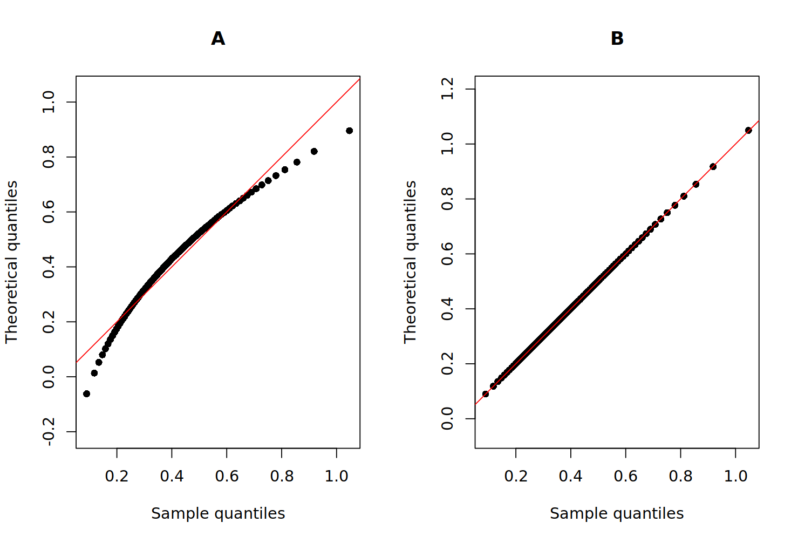